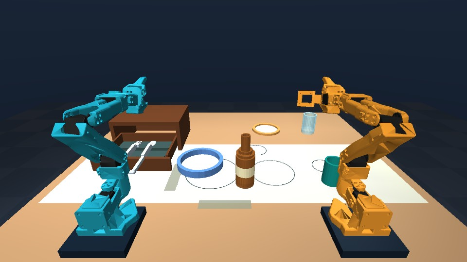

# Talos · Dinner-table robotics

Two simulated SO-101 arms learning to set a dinner table. This is our work in progress for the **AI Infra Summit Hackathon 2026 online Intel challenge and Speechmatics Bonus Award**. Dinner-scene development started **September 11, 2026**. [GitHub repository](https://github.com/jannissio/talos-ai-infra).



**Current milestone:** a physical six-skill dinner sequence: place the bottle, plate and mug, open a passive drawer, then retrieve and place the fork and spoon. Choose **Task start / Closed / Seed 42**, then **Run all six skills → Start dinner goal**. Each grasp, hold and release is verified. Uses exact simulator state; no trained vision/language policy is loaded. The side plate and glass remain staging assets. [Implementation, geometry changes and results](docs/robotics/DINNER_SCENE.md).

Start the local viewer in PowerShell:

```powershell
.\start-lab.ps1
```

Open [Talos on this PC](http://127.0.0.1:8765/). Stop with `.\stop-lab.ps1`. On a fresh checkout, first create a clean CPython 3.12 virtual environment and install `requirements.txt`; see [setup and controls](simulation_lab/README.md).

Read the [dinner scene, models and measured checks](docs/robotics/DINNER_SCENE.md) and the [current submission build plan](docs/hackathon/BUILD_PLAN.md). Project code and original dinner assets use [MIT](LICENSE); the SO-101 assets retain [Apache-2.0 attribution](simulation_lab/NOTICE.md). [Development and AI-assistance disclosure](docs/PROVENANCE.md).

**September 11 recheck:** kickoff is now listed as **17:00 CEST September 10**, submission deadline **20:30 CEST September 16**, and the portal is live. The Intel online PDF is unchanged; additional setup and speech resources are available. [Read the current challenge alignment](docs/hackathon/UPDATE_2026-09-11.md).

**Preserved preparation experiments:** select **Chemistry practice → Load seed** to use the September 8 BenchLab environment with randomized test-tube racks. These earlier experiments established physics, control and recording infrastructure; the submission now uses the dinner scenario.

**First autonomous milestone implemented:** load **Lift practice scene** and press **Start lift & return**. Either arm can physically grasp a tube, lift it, hold it clear, and return it. See the [implementation and measured results](docs/robotics/LIFT_AND_RETURN.md). This baseline uses simulator positions and inverse kinematics; it does not yet use vision, language, or a learned policy.

**Rack transfer and recording implemented:** choose **Load transfer practice → Start transfer**. The selected arm moves a tube to an empty slot in another rack while the other arm stays parked. Recordings include actuator commands, synchronized simulator observations and reconstructed images from three cameras. See [transfer and recording instructions](docs/robotics/TRANSFER_AND_RECORDING.md).

## The task in simple terms

Build a robot demonstration inside a computer. Two simulated robot arms should understand an instruction, look at the scene, and work together to arrange a dinner table. Show that it works when the scene changes, and measure how efficiently the AI runs on Intel hardware. Real robot arms are not needed for the online challenge.

For the bonus, let a person **speak the instruction through Speechmatics**, then show the robots responding to it. Our proposed concept is a voice-controlled table-setting assistant. Speechmatics supplements the main challenge; a voice-only app would not satisfy the published Intel brief.

Source: [Intel online challenge brief](https://drive.google.com/file/d/1xSisqTQUAFQiLOpjLZrCVTCsQi4bMCpO/view), especially pages 1–5; [event tracks and bonus](https://lablab.ai/ai-hackathons/ai-infra-summit-hackathon).

## Read these first

| File | Contents |
| --- | --- |
| [Hackathon brief](docs/hackathon/BRIEF.md) | Objective, participation, tracks, awards, technical requirements, judging, rules, and timetable |
| [Submission checklist](docs/hackathon/SUBMISSION_CHECKLIST.md) | Platform fields, Intel deliverables, bonus evidence, and final checks |
| [Development plan](docs/hackathon/PLAN.md) | Preparation now, proposed approach, and milestones through submission |
| [Open questions](docs/hackathon/OPEN_QUESTIONS.md) | Conflicting instructions and a ready-to-send organizer inquiry |
| [Sources](docs/hackathon/SOURCES.md) | Official references, original sponsor PDFs, and research limitations |
| [Robotics research](docs/robotics/RESEARCH.md) | State of the art through September 8, recent papers/releases, simulation assets, control options, and experiments before choosing an architecture |
| [Intel cloud assessment](docs/robotics/INTEL_CLOUD.md) | Current AI PC access offering and checks for qualifying Core Ultra hardware |
| [Autonomy strategy](docs/robotics/AUTONOMY_PLAN.md) | Ways to give the arms goals and the recommended path from a physical grasp baseline to learned, coordinated skills |
| [Lift & return milestone](docs/robotics/LIFT_AND_RETURN.md) | Working demonstration, scene adjustments, controller, verification, failures, and next steps |
| [Transfer and recording milestone](docs/robotics/TRANSFER_AND_RECORDING.md) | Rack-to-rack placement, current slot occupancy, demonstration format, measured results and validation |
| [AI control plan](docs/robotics/AI_CONTROL_PLAN.md) | Options for learned control, ACT-first recommendation, SmolVLA alternative, hardware feasibility and next experiments |

## Remaining submission requirements

1. **Arrange final-demo hardware.** This PC has an Intel Core i7-10850H, 16 GiB RAM, Intel UHD Graphics, and an NVIDIA Quadro T2000 Max-Q. Intel's final demonstration requirement specifies **Core Ultra Series 2/3** for both simulation and AI inference. This PC does not match that requirement. Access through a teammate, a loan, or an approved remote machine needs to be resolved; organizer-provided access is not confirmed.
2. **Use the corrected timetable.** The September 10 recheck resolves the old conflict: kickoff **September 10 at 17:00 CEST**; submissions close **September 16 at 20:30 CEST**. Our internal submission target remains September 16 at 18:00 CEST. All CEST times here are Berlin time, UTC+2. See the [dated update](docs/hackathon/UPDATE_2026-09-10.md).
3. **Disclose reused preparation work.** BenchLab's chemistry, control and recording infrastructure was developed on September 8; dinner assets and submission-specific scene work started September 11. Retain this history and disclose AI assistance. Reuse eligibility remains an organizer question; beginning dinner development does not establish an exemption.

Sources: local read-only hardware inspection; [Intel brief, page 3](https://drive.google.com/file/d/1xSisqTQUAFQiLOpjLZrCVTCsQi4bMCpO/view); [event schedule](https://lablab.ai/ai-hackathons/ai-infra-summit-hackathon); [live dashboard](https://lablab.ai/ai-hackathons/ai-infra-summit-hackathon/live); [general reuse guidance](https://lablab.ai/guide/ai-hackathons).

Next: physically grasp, lift and place the bottle with a goal controller; then add drawer and dish skills, collect demonstrations, and train a camera-based policy. Intel access and early model conversion checks should progress alongside this work. See the [current build plan](docs/hackathon/BUILD_PLAN.md); the [original preparation plan](docs/hackathon/PLAN.md) remains dated history.
