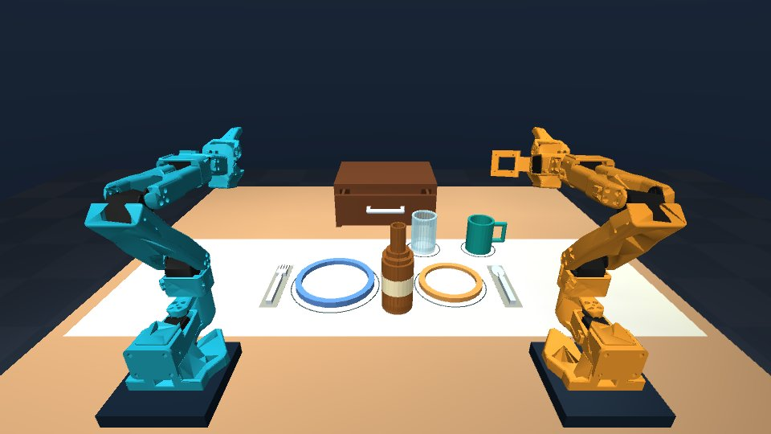

# Dinner-table foundation

Implemented September 11, 2026, after the user selected the published Intel dinner-table scenario. Talos is now the browser-facing project name; `simulation_lab` and the launch scripts are retained for compatibility. This milestone constructs and verifies the environment. Autonomous dinner execution and a learned policy are not implemented yet.

## Run and inspect

```powershell
.\start-lab.ps1
```

Open [the local viewer](http://127.0.0.1:8765/). The startup scene is **Dinner challenge / Task start / Seed 42**. Five cameras, both arms' joint controls, home/gentle motion, pause and 50 ms stepping are available.

- **Task start:** dishes/vessels are staged on the table and cutlery is inside the drawer.
- **Open for inspection:** choose this in “Drawer at reset” and load the setup. It initializes the drawer open; this is not a robot pulling it.
- **Target example:** initializes six items at their marked places and leaves the bottle in the serving area. It is an illustration of a desired arrangement, never counted as task success. This preset keeps the drawer closed because its open front would overlap the glass setting; inspect an open drawer in Task start instead. The API rejects the conflicting combination.
- **New arrangement / Load seed:** regenerate deterministic object variation. The drawer opening and preset are retained from the form.
- **Reset scene:** resets the currently loaded preset and seed, retaining its configured inspection opening.
- **Chemistry practice:** switch scenes and load to access all earlier tube goals and rack editing.




## Physical models

Canonical builders: [`simulation_lab/dinner.py`](../../simulation_lab/dinner.py). Portable, standalone MJCF inspection models: [`assets/dinner`](../../simulation_lab/assets/dinner/README.md), with hashes/specifications in its manifest. The application builds from the canonical code; regenerate the exported XMLs after asset changes.

| Object | Nominal dimensions | Nominal mass | Candidate grasp / model |
| --- | --- | --- | --- |
| Blue-rim plate | 132 mm diameter, 14 mm high | 65 g | Raised rim; compound shallow dish |
| Gold-rim side plate | 106 mm diameter, 12 mm high | 45 g | Raised rim |
| Teal mug | 50 mm body diameter, 64 mm tall; about 77 mm including handle | 45 g | Open handle with an 8 mm outer bar |
| Clear glass | 48 mm diameter, 74 mm tall | 35 g | Hollow segmented wall; grasp must be checked against aperture |
| Amber bottle | 48 mm body diameter, 140 mm tall, 22 mm neck | 80 g | Upper neck, candidate center 128 mm above bottom |
| Fork | 110 mm long, 17 mm wide, 8 mm maximum thickness | 12 g | 9 mm wide handle; four tines |
| Spoon | 110 mm long, 22 mm wide, 8 mm maximum thickness | 14 g | 9 mm wide handle; solid ellipsoid bowl approximation |
| Drawer | 95 mm travel; approximately 22 cm wide cabinet | 180 g moving tray | Passive slide joint and horizontal handle |

These are small, lightweight rigid props selected for the SO-101 scale, not full-size heavy crockery or measured real-world assets. They use free joints, gravity and collision geometry. No attachment/weld or runtime teleporting is used. The robot meshes, collision geometry, inertias, joint limits and twelve actuators remain unchanged.

Vessel walls and mug handles use separate collision segments, preserving hollow interiors. Bases are 14 mm thick: the first thin-base version allowed tiny fast-falling test probes to cross the base at a 5 ms timestep. The thickened version catches the tested probes. This does not establish arbitrary high-speed impact accuracy.

The drawer has no actuator. Pulling it requires force; tray-mounted supports carry the loose utensils through friction/contact. Flat undersides at the fork's support points remove the initial rocking. The inspection preset initializes both drawer and loose contents coherently at reset. Cutlery is not parented to the moving drawer.

The table remains 96 × 78 cm with its surface 76 cm high. The linen runner and placement outlines are visual only and cannot support or constrain objects. Spoon/fork locations on the runner are guides for a starter arrangement, not a claim about formal dining etiquette.

## Randomization and inspection data

Task-start seeds vary the five tabletop objects by up to ±9 mm in X/Y and ±0.12 rad yaw; cutlery uses ±3 mm and ±0.07 rad. Mass varies ±8%, sliding friction ±10%, and one light's intensity varies. Reference-object poses stay at the target examples, while physical parameters still vary with the seed. Dimensions, background and complex shapes are not randomized in this milestone.

`GET /api/state` exposes each object's position, upright/above-table flags, candidate grasp site, mass and dimensions, plus drawer displacement and placement guides. These are privileged simulator observations for inspection/teacher development. The displayed upright/above-table count is not a task evaluator or a stability-duration measurement.

`POST /api/reset` accepts `scenario: "dinner"`, `dinner_preset: "task" | "reference"`, `drawer_open: bool`, and `seed`. Old clients that omit `scenario` still get chemistry reset behavior. Dinner-specific calls to the tube controller or rack editor are rejected with a clear message; no dummy autonomous success is produced.

## Verification and reach limits

- **22 automated tests passed**, including earlier tube manipulation, failure handling, recording and the deliberately slow renderer test.
- **33/33 scene settling configurations passed:** seeds 0–9 and 42, each with closed task start, open task start and target example, simulated for 5 seconds. Checks require no initial penetration deeper than 0.5 mm, finite state, object tilt under 5°, origin above the support threshold, linear speed under 3 mm/s and angular speed under 0.15 rad/s.
- Force-based tests show the passive drawer moves and carries loose cutlery, while a fork can be lifted independently. Probe drops reach the interior bases of the mug, glass and bottle; these are solid probes, not simulated fluid.
- At seed 42, **either arm has collision-free isolated bottle approach/grasp/lift poses** under the existing upright-finger IK constraint. Both-arm simultaneous motion, a connected trajectory, gripping force, actual lifting and subsequent placement are not verified by that result.
- The plate, mug and cutlery candidates expose limitations of the existing tube-grasp orientation. Some cannot be reached at table level under that constraint; some drawer approaches collide with its front/walls. They require different grasp orientations and possibly revised staging/fixtures. Rear object placement is not certified reachable. This is recorded explicitly rather than treating a stable scene as a solved robotics task.
- Live checks cover cameras/stream, pause/step, joint limits, scene switching, presets, reproducibility, and clear rejection of unsupported dinner goals. Rendering and physics still run independently.

Evidence: [scene audit](dinner-scene-evaluation.json), [live API checks](dinner-live-check.json). The earlier chemistry task success counts remain in their own reports and do not apply to this dinner task.

```powershell
.\.venv\Scripts\python.exe -m unittest discover -s tests -v
.\.venv\Scripts\python.exe scripts\evaluate_dinner_scene.py
.\.venv\Scripts\python.exe scripts\check_live_lab.py
.\.venv\Scripts\python.exe scripts\check_live_dinner.py
.\.venv\Scripts\python.exe scripts\export_dinner_assets.py
```

The live check scripts reset the simulation and restore its setup afterward. Original physical trajectories are not preserved by a reset.

## Next milestone

Implement a physical **bottle pick / lift / place teacher** with a task state machine, entire-path collision checks, both-finger support verification, timeouts, cancellation and explicit failure handling. Then develop drawer/utensil and plate/mug skills with appropriate orientations, collect dinner demonstrations, and add learned camera-based control. Bring an Intel model export/inference check forward alongside this work. See [current build plan](../hackathon/BUILD_PLAN.md).

The final submission still needs language/vision reasoning, training/fine-tuning, meaningful two-arm coordination, qualifying Intel deployment and ten-seed task evaluation. Liquid dynamics, arbitrary contact robustness, learned policies and final challenge success are not claimed here.

Geometry was authored for this project under MIT; the SO-101 models retain their upstream Apache-2.0 notices. The compound primitive approach follows [MuJoCo's MJCF geometry and joint definitions](https://mujoco.readthedocs.io/en/stable/XMLreference.html). See [development/AI-assistance history](../PROVENANCE.md).
