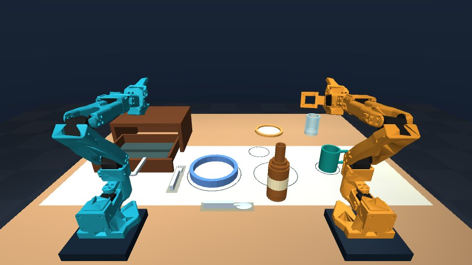
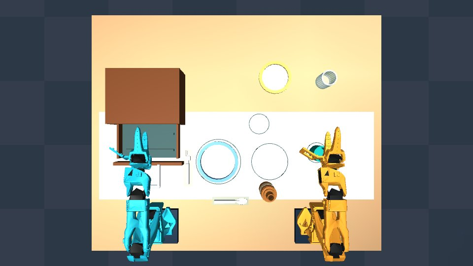

# Dinner-table physical baseline

Updated September 11, 2026. Talos now runs a physical six-skill sequence using exact simulator state. It is a demonstration teacher, not a trained vision/language policy. [Challenge alignment and source recheck](../hackathon/UPDATE_2026-09-11.md).

## Run it

```powershell
.\start-lab.ps1
```

Open [the local viewer](http://127.0.0.1:8765/), choose **Dinner challenge → Task start → Closed → Seed 42 → Load seed**, then **Run all six skills → Start dinner goal**. Allow about four minutes of simulation time; a busy PC can take longer. The live progress and per-skill results distinguish running, failed, cancelled and successful execution.

The sequence places the bottle, plate and mug, pulls the drawer open, retrieves and places the fork, then retrieves, rotates and places the spoon. The unused arm stays parked during each skill. The side plate and drinking glass are still staging assets; this sequence does not move them or pour liquid. Sequential use of both arms is not yet the coordinated two-arm behavior required by the challenge.

**Cancel** pauses physics, including a held object. Reset after a failed/cancelled run, or deliberately resume with manual controls. Individual goals are available, but depend on the scene: move the bottle and plate first to clear later paths, and open the drawer before retrieving cutlery. An impossible requested grasp fails explicitly. The full goal requires a closed Task start scene.

All five cameras, manual joints, home/gentle motion, pause/50 ms step, seeded resets and chemistry practice remain available. **Target example** and **Open for inspection** initialize physical state at reset and are never counted as autonomous results. The reference preset keeps its drawer closed by design. Open inspection shifts the initially staged plate 20 mm right to clear the extended front; it is an inspection preset, not the full-goal starting state.

## Physical models and layout changes

Canonical builders: [`simulation_lab/dinner.py`](../../simulation_lab/dinner.py). Regenerate the [standalone MJCF assets](../../simulation_lab/assets/dinner/README.md) after changes:

```powershell
.\.venv\Scripts\python.exe scripts/export_dinner_assets.py
```

| Object | Dimensions | Nominal mass | Implemented grasp |
|---|---|---|---|
| Blue-rim shallow plate | 132 mm diameter, 24 mm high | 65 g | Angled rim pinch from above |
| Side plate | 106 mm diameter, 12 mm high | 45 g | Staging asset only |
| Mug | 50 mm body diameter, 64 mm high; 77 mm with handle | 45 g | Rim pinch; the round handle grasp did not retain orientation reliably |
| Glass | 48 mm diameter, 74 mm high | 35 g | Staging asset only |
| Bottle | 48 mm body diameter, 140 mm high, 22 mm neck | 80 g | Upright neck pinch |
| Fork | 110 × 17 mm; 16 mm thick handle | 12 g | Pinch near the balance point |
| Spoon | 110 × 22 mm; 16 mm thick handle | 14 g | Pinch near the balance point, then rotate 90° |
| Drawer | 120 mm travel, approximately 220 mm cabinet width | 180 g tray | Passive handle grasp and pull |

These are small lightweight approximations, not measured full-size crockery. The blue plate changed from a 14 mm rim to a 24 mm shallow rim; thin cutlery handles changed from 8 to 16 mm thickness. The earlier thin sections slipped at the gripper tips. These wider contact areas establish a baseline; success does not imply the original thin objects can be handled.

The cabinet moved from the far center to the left reachable workspace, at **(-280, 180) mm**. Its handle projects farther forward, the drawer front and sides are lower, the support rails avoid the pinch point, and the cutlery spacing/staging was revised. The plate/mug starts and placement guides moved to clear wrist cameras, the open drawer and neighboring objects. The spoon is placed horizontally across the front. No invisible fixtures or attachments are present.

Bodies have free joints, explicit approximate inertias, gravity and physical collision geometry. Hollow vessels and the mug handle retain open interiors. Vessel bases are 14 mm thick to avoid the tested small-probe tunneling case at the 5 ms timestep. The two robots' meshes, collision shapes, inertias, joint limits and twelve actuators are unchanged. The drawer has a passive slide joint and **no actuator**.

## Controller and success criteria

Implementation: [`dinner_autonomy.py`](../../simulation_lab/dinner_autonomy.py), sharing IK, collision checks, quintic trajectories and torque saturation with the chemistry teacher.

- IK controls position plus the appropriate gripper axis and, for top-down grasps, closing direction. A scratch `MjData` is used for planning. Authoritative object positions/velocities are never written by the controller.
- Cartesian paths are sampled at approximately 2 mm intervals. Joint approaches/retreats and hypothetical carried-object poses are collision checked. The carried-object check uses the measured gripper aperture.
- Each skill has a simulation-time deadline. A failed initial pinch permits at most one reopen/retry when the object has barely moved. A few bounded alternative hover/lift/retreat paths address reach limits; all pass the same clearance checks.
- Both fingers must exert measured normal contact force. The object must stay independently supported during a 1.5 s hold, with no external contact. Runtime checks stop on slip, unexpected collision, excessive tilt or movement of the parked arm.
- Software gripper torque limits are 0.15 Nm for bottle/drawer, 0.50 Nm for the plate, 0.35 Nm for the mug and 0.30 Nm for cutlery, below the unchanged actuator force limits.
- Bottle lift exceeds 5 cm. Other objects lift enough to clear their supports. Bottle/plate/mug carrying tilt is limited to 15°; cutlery to 30°. Final flat/upright placement is checked separately.
- Release requires measured table support. Success requires position error below 6 mm horizontally and 3 mm vertically, near-upright orientation, low linear/angular speed, no finger support and no displaced neighboring object for one second. Cutlery yaw must match its target within 10°. The full sequence rechecks earlier placements after later skills.
- The drawer must follow a physical grasp, open beyond 105 mm and remain open after release. No force injection, position servo, weld or teleport drives it.

Physics/controller updates remain at a fixed **200 Hz**, separately from the camera process and browser frames. Planning and telemetry use the simulator state, not rendered images. Existing episode recording can capture full simulator state/actions through the API; this milestone does not claim a trained dataset or learned policy.

## Measured result

- **11/11 full sequences passed** on seeds 0–9 and 42, taking 249–250 seconds of simulation time each.
- Across these runs, maximum placement error was **5.34 mm horizontally** and **0.035 mm vertically**. Maximum motion of the parked arm was **0.039°**. These counts cover the small seeded variations of this custom scene, not arbitrary layouts or official policy evaluation.
- **33/33 reset/settling configurations passed** (the same seeds, closed start/open inspection/reference presets).
- **27 automated tests passed**, including the complete contact-only sequence, a gripper fault with exactly one retry, cancellation, timeout, external disturbance, old chemistry goals, recording, and deliberately slow rendering.

Seed 42 example:

| Skill | Arm | Peak lift / opening | Placement error |
|---|---|---|---|
| Bottle | Left | 6.41 cm lift | 1.31 mm |
| Plate | Left | 4.66 cm lift | 1.18 mm |
| Mug | Right | 3.37 cm lift | 0.65 mm |
| Drawer | Left | 11.78 cm opening | Not applicable |
| Fork | Left | 3.39 cm lift | 0.58 mm |
| Spoon | Left | 3.39 cm lift | 0.57 mm |

## Verification

Reproduce the checks:

```powershell
.\.venv\Scripts\python.exe -m unittest discover -s tests -v
.\.venv\Scripts\python.exe scripts/evaluate_dinner_scene.py
.\.venv\Scripts\python.exe scripts/evaluate_dinner_autonomy.py --seeds 42,0,1,2,3,4,5,6,7,8,9
.\.venv\Scripts\python.exe scripts/check_live_dinner.py
```

The physical evaluator asserts on every controller tick that no authoritative position or velocity changed outside physics, no applied forces appeared, and there are only the original twelve actuators and zero equality attachments. Failure tests cover closed-drawer refusal, invalid goals, cancellation, unresponsive servos and an externally disturbed grasp. Existing chemistry, recording and slow-renderer tests remain in the suite.

Measured results are in [physical sequence evaluation](dinner-autonomy-evaluation.json), [scene stability](dinner-scene-evaluation.json), and [live interface checks](dinner-live-check.json). These reports are separate: a stable reset scene is not task success, and an exact-state teacher run is not official learned-policy or Intel evidence.

## Browser result

The full sequence also completed through the live browser in 249.7 seconds of simulation time. [Live telemetry and interface checks](dinner-browser-demo.json). These are actual completed-task views, separate from the reset examples.





## Remaining work

Generalize grasps and trajectories across broader layouts and thinner objects; add a genuinely coordinated two-arm action; collect varied demonstrations; train camera-based control; integrate language and Speechmatics; obtain Core Ultra Series 2/3 hardware and benchmark there. The fixed order and hand-designed geometry remain limitations. See the [submission build plan](../hackathon/BUILD_PLAN.md).
