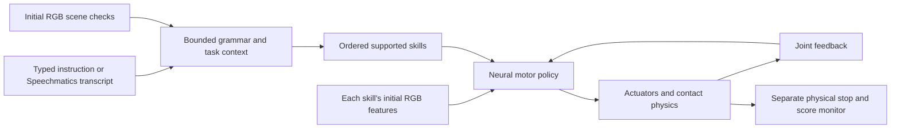

# Talos v6: measured architecture and active work

September 13, 2026. This describes the selected submission baseline. The broader development goal remains active; its open items are tracked in the [completion checklist](../hackathon/FINAL_SUBMISSION_CHECKLIST.md).

## Execution path

1. Typed text or Speechmatics transcription enters a bounded grammar. Supported instructions include setting the table, named dishes, drawer opening and a bottle relay. This is not an unrestricted language model.
2. Classical RGB geometry from overhead and two calibrated workspace views checks bottle region, obstructed paths and drawer state. The planner inserts supported preparation skills, such as clearing the plate before opening the drawer. A farther-left bottle can select the trained reverse relay. Ambiguous observations and unsupported goals are refused.
3. Each skill captures its own initial RGB views. Classical geometry encodes them into a 32-dimensional visual context. A small neural network with three 256-unit SiLU layers maps context and progress to 12 joint targets. It never loads demonstration action arrays at runtime.
4. Measured joint positions and velocities regulate neural progress. Interpolated commands drive MuJoCo actuators. The five new dinner policies retain the inactive arm's previous targets at transitions. Every skill releases and parks before chaining to the next.
5. A separate privileged-state monitor measures contacts, lift, collisions, placement, release and parking. It can stop or score a trial, but does not generate the learned motor targets. Later skills must preserve previous placements.



The programmed mode retains its exact-state inverse-kinematics controller. The learned mode has no silent programmed fallback, attachments, teleportation, equality constraints or hidden forces. Harness disturbance experiments are explicitly declared separately.

## Models and evidence

| Component | Training input | Measured outcome |
| --- | --- | --- |
| Preserved upright bottle | 22 compact episodes | 10/10 small-jitter tests; historical wider development 1/3 |
| Plate, mug, drawer, fork, spoon | 201 eligible episodes, all aligned action replays pass | Full v6 dinner sequence 8/10 frozen starts; all six development scenes and seed 42 pass |
| Four bottle-relay legs | 52 eligible episodes, all aligned action replays pass | 5/5 left-to-right and 5/5 right-to-left frozen trials |
| Experimental RGB observer and Cartesian motor map | 10,112 rendered states; 4,056 offline kinematic labels | Perception p95 1.938 mm; final physical nominal live 2/12, pushed live 3/12; not promoted |

The dinner failures are seed 2026091902 (mug 14.59 mm XY error) and 2026091905 (spoon 13.61 mm). The acceptance threshold remains 8 mm. Every outcome is retained under [dinner evidence](evidence/learned-dinner-v6/summary.json) and [relay evidence](evidence/learned-relays-v3/summary.json). These are fixed goals and disclosed finite starting regions, not a guarantee for any reachable position.

Models are safetensors plus FP32 OpenVINO IR. Training inputs named `retrieval.npz` are offline supervised data only. See [dinner retraining](../../training/dinner_suite/README.md), [relay retraining](../../training/bottle_relays/README.md) and the preserved [bottle instructions](../../training/bottle_visual/README.md). All new training used the RTX 4070. Original files remain byte-identical.

## Deployment

The full local browser uses FastAPI, MuJoCo and OpenVINO CPU inference. The private Gradio Space runs MuJoCo/OSMesa on CPU and defaults to OpenVINO CPU inference. An explicit shared-GPU option requests fresh neural trajectory predictions at each skill's initial image. The worker samples those predictions with the same motor-feedback guard. This is a cache of current model outputs, not retrieval of training trajectories. Cloud GPU allocation can fail and is reported separately from a physical grasp failure. The compact Space has one selected camera and no microphone capture; the local lab offers the complete interface.

All promoted OpenVINO exports pass numerical parity on this AMD/NVIDIA PC. Historical original-bottle inference timings on i7-10850H/Intel UHD are not final-suite measurements. [Final Intel verification](INTEL_FINAL_VERIFICATION.md) still requires the actual laptop, renderer/device evidence and resolution of the Core Ultra eligibility wording.

## Reproduction

The [composed-command evaluation](evidence/composed-dinner-v1/README.md) directly exercises the production language/RGB planner on the finite left-reach bottle preset. It selects both reverse-relay legs before plate, mug, drawer, fork and spoon. The unchanged models complete 8/10 freshly frozen workflows; every trial passes both relay legs and the intermediate tasks, while two spoon placements miss the 8 mm limit. All 14 development/final traces and a ten-trial video are packaged. This extends the verified composition beyond the original reset region without claiming general workspace coverage.

Install the environments from the root README, then use unused output paths:

```powershell
.\start-lab.ps1 -Learned -DinnerSuite models/dinner_suite/suite.json
.\.venv-training\Scripts\python scripts/evaluate_learned_dinner.py --suite models/dinner_suite/suite.json --skills bottle,plate,mug,drawer,fork,spoon --seed 2026091901 --output .run/reproduce-dinner-v6.json
.\.venv-training\Scripts\python scripts/evaluate_learned_dinner.py --suite models/dinner_suite/suite.json --skills relay_bottle_left,relay_bottle_right --seed 2026092501 --output .run/reproduce-relay-v3.json
.\.venv-training\Scripts\python scripts/evaluate_learned_dinner.py --suite models/dinner_suite/suite.json --skills reverse_bottle_right,reverse_bottle_left --bottle-start wide_left --seed 2026092601 --output .run/reproduce-reverse-v3.json
```

These seeds are exposed reproduction cases. Use `--capture` with a fresh folder for actual state traces. Check disk before every dataset, episode and export; keep 10 GiB plus expected writes. Do not overwrite existing evidence.

## Experiments beyond the baseline

The [RGB-servo protocol](experiments/rgb-servo-bottle-v1.json) declares a 48-pair approach grid, varied training scenes, requested destinations and paired live/frozen image tests. The approach probe found 27 candidates, covering 21 of 24 positions with at least one arm; that is not full physical reachability proof. An exposed RGB probe found amber-arm ambiguity and an unsuitable camera view.

Three fixed cameras, a custom CNN observer and a neural Cartesian motor map are implemented. Training/scoring use synthetic segmentation, projected keypoints and offline IK labels; action inputs exclude simulator object poses and inference-time IK. The final rigid observer passes its fresh perception test at 1.938 mm p95. All 48 frozen physical trials complete: nominal live 2/12, nominal frozen 1/12, pushed live 3/12 and pushed frozen 0/12. Seven starts are refused before movement. Only one seed passes both undisturbed controls; live images recover its 8.77 mm push, while frozen images fail. The candidate remains experimental and is not selected for the dinner workflow. Its [models and reproduction commands](../../models/bottle_servo_v1/README.md) and [all outcomes](evidence/rgb-servo-v1/README.md) are packaged. See the [experiment record](RGB_SERVO_PROGRESS.md) for earlier failures and the corrected target-label bug. Absolute bottle yaw is not an observer output because the known bottle is nearly rotationally symmetric.

The separate [V2 routing experiment](evidence/rgb-servo-v2/README.md) reuses the same weights with independently selected lift/transport heights and optional table-supported relays. Its new frozen set completes 48 cases: nominal live 6/12, nominal frozen 2/12, pushed live 5/12 and pushed frozen 1/12. Three seeds are refused before motion. It also misses its promotion gate; only one seed passes both undisturbed controls. Both development revisions and every final outcome are retained. Neither experiment replaces the selected six-skill workflow.

Pouring, general other-object handoffs, airborne exchanges, broad object/lighting variation and unrestricted instructions remain unfinished. Preparing submission assets does not complete these development stages.

The subsequent [V3 motor-only refinement](evidence/rgb-servo-v3/README.md) improves its original exposed kinematic development fit to 361/362 accepted points and 0.564 mm p95 error, but misses the declared 0.500 mm gate. Both candidates are preserved. It consumes 6,000 additional training steps and stops without a physical trial or OpenVINO export; no deployed component changes.

[V4](evidence/rgb-servo-v4/README.md) also stops offline at 0.512 mm p95. The separately bounded [V5](evidence/rgb-servo-v5/README.md) reaches 0.367 mm and passes the offline gate, but all 24 subsequent development trials yield only 3/6 nominal and 3/6 pushed live successes. It misses the unchanged 4/6 development gate; final scenes remain unexposed and the model is not promoted. Two live scenes lose RGB during approach/descent and one is refused at reset. Motor precision alone does not solve visibility or broad physical coverage.

An exposed fixed-camera diagnostic then recovers those missing views, but the [fresh paired perception test](evidence/rgb-servo-camera-perception-v1/README.md) accepts only 202/237 present bottles with opposite oblique cameras, below its 90% requirement. It stops before physical trials. These camera candidates remain separate from the selected dinner system; accurate estimates on accepted frames do not establish adequate detection coverage.

A separately bounded [paired-camera observer adaptation](evidence/rgb-servo-observer-camera-v1/README.md) trains on new procedural states, with 6,000 updates and unchanged rigid decoding. Its selected checkpoint passes development and FP32 export checks. Fresh opposite-view perception accepts 226/232 present states with no absent false accepts, but its 7.124 mm maximum exceeds the unchanged 6 mm limit despite 2.293 mm p95. It stops before physical trials and remains outside the dinner workflow. Exact sampled states/labels, image hashes, both checkpoints and all scores are preserved; no new final physical coverage is claimed.

The subsequent [spoon release-label experiment](evidence/spoon-release-v1/README.md) tests finite dinner reliability separately. All 39 revised physical demonstration replays pass before one 12,000-update fit. The candidate and baseline each complete 4/6 standard and 4/6 left-reach development workflows, with identical failures at the preceding mug step and successful spoon placements whenever reached. The unchanged 5/6 development gate fails. All 24 outcomes and both runtime configurations are preserved; the candidate is not promoted and its reserved final scenes remain unexposed.

A separately declared [mug release-label fit](evidence/mug-release-v1/README.md) also completes its input gate (41/41), training and export parity. It regresses in all 24 paired development workflows: the baseline passes 6/6 starts per preset and the candidate 4/6. All evidence and the candidate are retained, with final scenes unexposed and no deployed change. Improved supervised label loss alone has not established improved physical placement; visual correction during placement remains an architectural development requirement.
