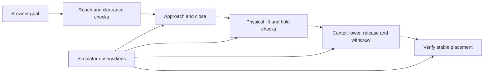

# Lift & return: first autonomous milestone

Implemented and tested on **September 8, 2026**, in the user-authorized local chemistry sandbox. This is preparation work, separate from the final hackathon submission.

**Follow-up:** [rack-to-rack transfer and synchronized recording](TRANSFER_AND_RECORDING.md) have since been implemented. This document retains the measurements and design notes for the first lift-and-return milestone.

## What works

From the browser, one SO-101 arm selects a reachable tube, grasps it through physical contacts, lifts it approximately **5.7 cm**, holds it clear of the rack for **1.5 seconds**, and returns it upright to the original slot. The other arm stays parked. After opening its fingers, the working arm withdraws and parks; placement must remain stable for **one second** before success is reported.

This controller uses **exact MuJoCo object positions**, inverse kinematics, controlled trajectories and a finite-state task controller. No learned policy, camera perception, language model, artificial attachment, equality weld, prop teleportation, or external lifting force is used.

## Try it

```powershell
.\start-lab.ps1
```

Open [BenchLab](http://127.0.0.1:8765/), choose **Seed 42 → Load lift practice scene → Start lift & return**. Leave both selectors on **Choose automatically**. Alternatively, use the left arm with A2 or the right arm with B2. The run takes about **35.35 seconds of simulation time**. Camera FPS and the ratio of simulation time to real time are displayed separately.

The camera-side status strip stays visible with the scene on a narrow browser panel. The goal panel also provides stage progress, elapsed time, lift height, verified hold duration and result details. **Pause** freezes the task clock; **Step 50 ms** advances physics and the controller together.

**Cancel ends the goal and pauses the entire simulation.** It retains the current physical state, including a tube being held, rather than automatically opening the fingers. Reset the scene for a clean next attempt. After cancellation, manual controls become available again. Resuming manually no longer runs the autonomous retention checks.

## Why the practice scene changed

The original scene is useful for exploration but has several manipulation difficulties:

- Several rear and opposite-side tube positions cannot be reached with the needed finger orientation.
- Densely occupied racks can obstruct the gripper, its opening motion or its approach.
- Rounded tube bottoms on a flat rack base can slowly tip within loose guides even without robot contact. This also makes an exact return harder to evaluate.

The dedicated practice preset therefore uses:

| Component | Practice configuration |
| --- | --- |
| Racks | Two, near the respective arms, rotated approximately −15° / +15° |
| Randomization | Rack X/Y variation up to 4 mm and yaw variation up to 4° around the practice anchors |
| Occupancy | Three tubes per rack: front middle and rear corners; three empty slots |
| Tube geometry | Flat-bottom cylindrical training tubes, 18 mm diameter, 102–106 mm height, with 21 mm caps |
| Guides | Approximately 22 × 22 mm openings, giving less lateral play |
| Robot | Original collision meshes, inertias, joint limits and actuator definitions retained |

These are ordinary dynamic rigid bodies with gravity, friction and collisions. The modifications are visible scene design choices, not hidden constraints attaching tubes to the rack or robot. **Load seed** selects the original general scene, which retains rounded tubes, its original guides, 2–4 racks and denser occupancy. **Reset scene** retains the current scene mode and rack poses.

Early rounded-tube trials exposed both slip and return failures. The evaluation below applies specifically to the final practice configuration. General-scene manipulation is not claimed to be equally reliable.

## Controller design



### Kinematics and trajectories

The arm has five arm joints and one gripper joint. The IK solver constrains a point between the fingers and aligns the gripper's local Y axis with world up. It leaves the remaining orientation freedom available to the arm. A downward approach-axis grasp was unsuitable for these base/rack heights; the implemented grasp pinches sideways with vertically aligned finger faces.

The solver uses MuJoCo Jacobians with damped least squares and joint limits. IK and collision checks run on a separate scratch `MjData`, so they do not modify the physical scene. Cartesian segments are solved in increments of at most approximately 2 mm. Joint and Cartesian paths use quintic time scaling. The controller uses a 0.15 Nm gripper torque cap, implemented through the existing position actuator, to avoid crushing the light tube with the original full servo force limit.

Reach and sampled collision checks run before selecting a candidate and before subsequent paths. Runtime contact checks stop unexpected arm contact. These checks support this narrow task; they are **not a global motion planner or a proof of continuous collision-free motion**.

The task stages are planning, approach, descend, close, lift, hold, align, lower, release, retract, park and verify. Return alignment uses the observed tube position to correct displacement within the fingers. Lowering stops as soon as the rack base supplies measured support, avoiding a blind push to a fixed endpoint. During release, the gripper also moves slightly away from the fixed finger before retracting vertically.

### Physical success checks

Closing the gripper or reaching an IK target is insufficient for success. The controller verifies:

- Nonzero contact force from both the fixed and moving jaw.
- An elevated tube, with its bottom clear of the rack and no external supporting contact during the hold.
- Retention throughout a 1.5-second hold; excessive slip or tilt fails the task.
- Support from the original rack base before release.
- After release and withdrawal: slot error below 4.5 mm, vertical error below 2 mm, tilt below 10°, low linear/angular speed, no finger support, and stable placement for one second.
- The other arm remains parked and other tubes remain essentially undisturbed.

The tests independently assert that controller updates do not change physical `qpos`, the model has no equality attachments, and no external body/generalized forces are applied. Object movement comes from MuJoCo integration and contact forces.

### Failure handling and cancellation

Unreachable or obstructed candidates are rejected. A missing grasp gets **at most one reopen/reposition retry**, then fails. Lost contact, excessive tilt, collision, stalled motion or unsuccessful placement produces a reason and pauses physics. Each motion has a finite timeout, and the whole goal has a **75-second simulation-time** limit. Cancellation ends the task immediately and pauses physics; it does not silently complete or restart the goal.

While a goal owns the arms, the backend rejects manual joint/preset commands and duplicate starts. Camera, pause and step remain usable. Explicit scene resets replace the current experiment. Goals start with both arms parked; use Home and let them settle, or reset, before retrying from a manually modified pose.

## Timing architecture

The physics/controller thread uses **5 ms fixed steps**, independent of HTTP polling or camera refresh. A spawned camera process compiles its own model and owns its own rendering data and OpenGL context. Bounded queues carry the newest scene snapshot and JPEG; obsolete snapshots/frames can be dropped. All process-to-process transport runs on a helper thread too: reading a partially serialized queue message must never block physics.

Separating rendering into only another thread still caused wall-clock stalls on this laptop. Process isolation and moving queue transport off the physics thread resolved the observed coupling. The timing regression test inserts **400 ms delay per camera frame** and checks that physics still advances at 0.85–1.15 times wall time, with pause/step preserved. The camera process closes on normal shutdown and notices if its parent server exits; the stop/restart workflow was checked for leftover processes.

The operating system and CPU can still cause delays. Catch-up is bounded, and `real_time_factor` plus `dropped_wall_time_s` make that visible. “200 Hz” describes the controller's simulation-time cadence, not a hard real-time guarantee or a learned-policy inference benchmark.

Reference for MuJoCo state/control and separate simulation data: [MuJoCo 3.12 simulation programming documentation](https://mujoco.readthedocs.io/en/3.12.0/programming/simulation.html).

## Measured results

[Machine-readable practice evaluation](autonomy-evaluation.json), using the final flat-bottom practice setup:

| Check | Result |
| --- | --- |
| Practice seeds | 0–9 and 42 |
| Completed lift-and-return trials | **11 / 11** |
| Peak tube lift | **5.677–5.697 cm** |
| Minimum recorded height at the end of verified hold | **5.564 cm** |
| Verified hold | At least **1.5 s** in every trial |
| Maximum final slot error | **0.298 mm** |
| Maximum final tilt | **0.007°** |
| Largest measured gripper actuator torque | **0.15 Nm** |
| Parked-arm motion | Below telemetry rounding of **0.0001°** |
| Unexpected arm collisions | **0** in these trials |
| Task duration | **35.345–35.350 simulation seconds** |

These are deterministic simulator measurements in a narrowly defined practice distribution, not claims about real hardware, unseen environments or arbitrary rack layouts. Contact models and idealized rigid props contribute to the precision. Some seeds were used during development; this is a regression/evaluation set, not an untouched benchmark.

**11 unit/physics/timing tests** passed, including both arms, missing-grasp retry, lost grasp, stalled-arm timeout, unreachable targets, cancellation, original scene invariants and deliberately slow rendering. **Six live API check groups** passed, preserving all cameras, streaming, pause/step, joint controls, seeded layouts, custom rotations and input validation. JavaScript syntax passed.

Browser checks verified physical holding, stage progress, pause/step, cancellation while holding, unreachable-target feedback and completed execution. [Held-state camera image](lift-and-return-hold.jpg) and [final live demonstration telemetry](autonomy-live-demo.json) accompany the headless results. The loading-overlay fix remains intact.

In the monitored final browser interval, **20.095 simulated seconds advanced in 20.267 wall-clock seconds**, with mean reported camera rate **18.55 FPS** and mean simulation / real time **1.00×**. The complete task reported success at 35.345 simulated seconds, with about **0.31 mm** final slot error. This interval covers the latter part of the run, not a separate full-run hardware benchmark. Runtime varies with PC load.

## Files and reproducibility

- [Controller and IK](../../simulation_lab/autonomy.py)
- [Physics and command ownership](../../simulation_lab/engine.py)
- [Independent renderer](../../simulation_lab/rendering.py)
- [Scene and practice geometry](../../simulation_lab/scene.py)
- [Headless evaluator](../../scripts/evaluate_autonomy.py)
- [Autonomy tests](../../tests/test_autonomy.py) and [timing test](../../tests/test_engine_timing.py)
- [Running instructions and HTTP interface](../../simulation_lab/README.md)

```powershell
.\.venv\Scripts\python.exe -m unittest discover -s tests -v
.\.venv\Scripts\python.exe scripts\evaluate_autonomy.py
.\.venv\Scripts\python.exe scripts\check_live_lab.py
```

The evaluator needs no running server or browser. The live API check resets physical state, then restores layout/settings. Runtime outcomes and stage/metric logs go to `.run/autonomy/` and `.run/autonomy-last.json`. No new Python dependency was required; the existing clean CPython `.venv` remains in use.

## Remaining limits and next step

This is a single-arm skill with the second arm parked. Rack-to-rack transfer, two-arm hand-off, perception, natural-language goals, learned policies, demonstration datasets and Intel deployment are still future work. The exact-state interface deliberately exposes information a camera-based policy would need to estimate.

Next, define a **reachable empty destination slot**, extend the validated placement stage to that slot, and record synchronized observations/actions/outcomes. Revisit rack/base placement to establish a shared transfer region before implementing a two-arm hand-off. The current task logs help diagnose behavior, but are not yet a complete training dataset.
