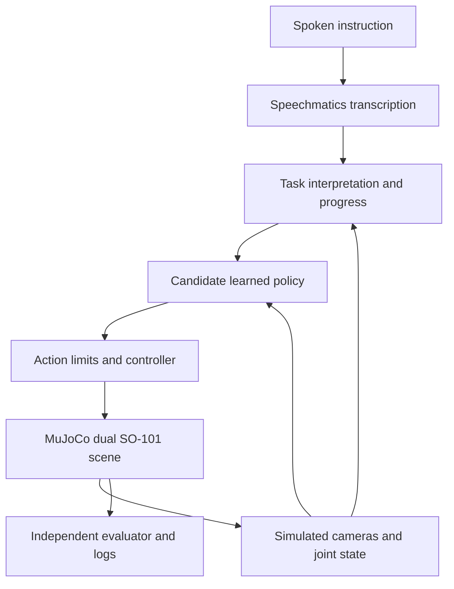

# Robotics and simulation: decision research

**September 11 follow-up:** the [evidence-based training plan](TRAINING_RESEARCH_PLAN.md) applies newer research to the implemented dinner teacher and specifies data, training and evaluation gates. The [mjbatch review](MJBATCH_REVIEW.md) covers the September 10 CPU-batching release, source inspection and Windows/version incompatibilities. The original research snapshot below is retained for context.

**Research cutoff: September 8, 2026.** Prepared for our online Intel entry in the AI Infra Summit Hackathon, with the Speechmatics Bonus Award. This is preparation research, not a finalized architecture or an implementation.

The review prioritizes **June–September 2026**, including papers from **August 27** and software releases from **August 18–28**. May work is included where it materially affects our choices. Older models are explicitly labeled as engineering baselines, not presented as new state of the art. The scope is language-conditioned, camera-based, bimanual manipulation; locomotion and unrelated humanoid capabilities are outside the decision.

## Executive answer

**Reuse the simulation engine and robot models; expect to assemble or adapt the task environment.** The current public Intel brief specifies MuJoCo and two simulated SO-101 arms. It does not establish that entrants receive a hosted simulator, complete dinner-table scene, pretrained solution, or dataset. The live track still links only to the same five-page brief, whose bytes were rechecked against our saved copy. Private welcome material may add resources later. Intel explicitly does not provide training infrastructure. [Intel online brief](https://drive.google.com/file/d/1xSisqTQUAFQiLOpjLZrCVTCsQi4bMCpO/view), pages 1–4; [current event](https://lablab.ai/ai-hackathons/ai-infra-summit-hackathon).

**The strongest starting point is ordinary CPU MuJoCo plus the official Menagerie SO-101 assets.** A small Gymnasium-style task layer would define the two arms, table objects, cameras, actions, randomized resets, and success checks. Recent Mink and SO101-Nexus work can reduce controller and environment effort. None of those components is itself a complete competition entry.

**The latest frontier does not remove embodiment adaptation.** There are substantial advances in transferable representations, action generation, timing, and task reasoning. However, we did not verify an openly available pretrained policy that already solves coordinated **dual-SO-101 dinner-table manipulation in MuJoCo**. Google reports relevant bi-arm SO101 adaptation, but its action models require early access.

**Our next decision should be experimental.** Compare a small learned policy, a modular planner/skill architecture, and a larger policy only if hardware permits. The practical policy shortlist is **SmolVLA, EVO1, and MolmoAct2**. VLAct and FlashVLA supply recent research ideas and potential later options. This is a feasibility shortlist, not a claim that these three lead a universal benchmark.

No paywalled paper is currently blocking these decisions. The key constraints are target hardware, suitable demonstrations, compatible software, and organizer clarification.

## 1. What the organizer supplies—and what is still unknown

| Layer | What is established | What we should plan for |
| --- | --- | --- |
| Challenge specification | Public Intel PDF; target robot, simulator, deployment and evaluation requirements | Follow the brief and confirm ambiguous task scope |
| Physics engine | MuJoCo is publicly available | Install a compatible version in our environment later |
| Robot geometry/dynamics | Official reusable SO-101 MJCF exists independently of the event | Compose two instances with unique names and suitable base positions |
| Complete table-setting environment | No organizer package or access link verified publicly | Build/adapt the task wrapper, scene, objects and evaluator unless one is supplied |
| Policy and demonstrations | Candidate algorithms are named; a task-specific dataset is not supplied in the public brief | Obtain or generate suitable demonstrations and adapt a policy |
| Training compute | Intel states it is not provided | Use an available machine or separately arranged compute |
| Final demonstration compute | Core Ultra Series 2/3 specified in deployment requirements | Secure qualifying access; current i7-10850H does not match |

The distinction matters: **MuJoCo is the physics engine; a robot model is one asset; an environment defines the actual problem.** We need the last layer even when the first two are reusable.

One concise organizer question would resolve the main uncertainty:

> Will online teams receive a dual-SO-101 MuJoCo scene, table/utensil assets, starter policy, demonstrations, or fixed evaluation seeds? If so, when and through which link? If not, may we construct our own scene, and what task sequence and pouring abstraction are accepted?

This inquiry has not been sent. Existing contacts and other unresolved eligibility details remain in [the hackathon questions register](../hackathon/OPEN_QUESTIONS.md).

## 2. Recent advances that matter for our decision

These are **reported results and inspected artifacts**, not experiments reproduced on our computer. Paper publication, repository release, and checkpoint availability are kept distinct.

### VLAct: representation quality and transfer, August 27, 2026

Senqiao Yang, Chengyao Wang and colleagues propose continued pretraining that preserves useful VLM representations while adding action supervision across embodiments. The work uses a **Qwen3-VL-4B backbone**, with separate downstream action heads and adaptation. It is relevant to transferring from broader robot data into bimanual skills.

The paper covers RoboTwin and real dual-Franka tasks. Real dual-arm adaptation used **100 demonstrations per task**; the study is not evidence that an arbitrary new arm works without adaptation. The paper's 16-GPU pretraining setup is outside a sensible hackathon baseline. The base checkpoint is explicitly for further adaptation. Also, the released RoboTwin checkpoint uses a GR00T head, whereas a prominent reported result uses OFT: downloading a checkpoint does not necessarily reproduce the headline table.

**Decision:** a current representation-learning reference and a possible larger alternative; no verified Intel or dual-SO101 deployment. Public code and selected checkpoints exist, but exact first upload dates were not established. Code is MIT; the inspected base checkpoint declares Apache-2.0.

Sources: [Beyond Data Scaling: Representation-Centric Continued Pre-training for Vision-Language-Action Models — Yang et al., August 27, 2026](https://arxiv.org/html/2608.27550v1); [StarVLA project](https://starvla.github.io/VLAct/); [code](https://github.com/starVLA/VLAct); [base model card](https://huggingface.co/StarVLA/VLAct_Qwen3_Pretrain).

### FlashVLA: responsive action execution, August 27, 2026

Zekai Li, Jiaming Tang and Zhijian Liu study how a policy can keep acting while generating its next actions. Their method maintains action chunks at different noise levels with causal attention, improving temporal continuity during asynchronous execution. It requires model changes and fine-tuning; it is not an inference flag.

The paper reports **26.7 ms versus 45.8 ms** on an RTX 4090 with two camera views, with matched CUDA Graph/kernel optimizations. Training used **eight H200 GPUs**. These numbers cannot predict Core Ultra performance. A further useful finding is that rendering dominated their RoboTwin runtime, limiting whole-system gains despite faster policy inference.

**Decision:** adopt the lesson to measure observation age, time to react, and complete-system latency. Do not make FlashVLA adaptation a prerequisite for the first working prototype. An Apache-2.0 implementation is public and the repository advertises checkpoints; direct checkpoint access was not independently confirmed.

Sources: [FlashVLA: Streaming Action Decoding for Fast and Asynchronous VLA Inference — Li, Tang and Liu, August 27, 2026](https://arxiv.org/html/2608.27384v1); [official implementation](https://github.com/z-lab/flashvla).

### MolmoAct2: open models, relevant robot data, and an Intel lead

Haoquan Fang, Jiafei Duan and colleagues at Ai2 released MolmoAct2 in **May 2026**, with full training code on **June 13** and LeRobot fine-tuning fixes on **August 22**. It combines an embodied VLM with a flow-matching action expert; an optional variant adds adaptive depth reasoning. Separate checkpoints cover single SO100/101, bimanual YAM, DROID, and benchmarks.

The SO100/101 data uses **six-dimensional actions**, while the bimanual checkpoint is for YAM. Those are separate embodiments, not evidence of a ready 12-action dual-SO101 policy. Its often-quoted **56.7% SO100/101 result is a partial-credit score**, awarding reaching/picking/placing milestones across 15 trials per task, not a binary full-task success rate.

The official repository states Intel **PyTorch XPU** inference was validated. This does not establish OpenVINO conversion or acceptable Core Ultra latency. LeRobot's documented port reports **12.1 GiB bf16 inference** under its own NVIDIA/Ubuntu setup; it is a memory reference, not a measurement on our machine.

**Decision:** the most interesting larger open candidate to test, conditional on memory, embodiment adaptation, and Intel profiling. Code and models declare Apache-2.0.

Sources: [MolmoAct2: Action Reasoning Models for Real-World Deployment — Fang, Duan et al., May 4 / revised May 8, 2026](https://arxiv.org/html/2605.02881v2); [official release chronology and Intel statement](https://github.com/allenai/molmoact2); [LeRobot v0.6.0 model documentation](https://huggingface.co/docs/lerobot/v0.6.0/molmoact2).

### SmolVLA: an older small baseline, with an August deployment study

SmolVLA is a **June 2025** model, roughly **0.5B parameters**, not a new 2026 frontier release. Its small size, LeRobot integration, and inclusion in Intel's policy tooling make it worth retaining as an engineering baseline.

The **August 24, 2026 ROS2SmolVLA** study is a useful reality check: adaptation to a UR10e involved **349 demonstrations** and about **25 hours on an L40S**; inference used an RTX 4080. Its simulation-training route was not fully validated. Small models still require substantial data and integration, and that study is not a dual-SO101 result.

**Decision:** first compact candidate for a controlled test. Confirm the chosen checkpoint and dataset terms separately: the base model is public and ungated, but its retrieved model-card metadata did not declare a license. LeRobot's code license alone does not settle all checkpoint/asset rights.

Sources: [SmolVLA — Hugging Face, June 3, 2025](https://huggingface.co/blog/smolvla); [base checkpoint](https://huggingface.co/lerobot/smolvla_base); [ROS2SmolVLA — Nils Mandischer et al., August 24, 2026](https://arxiv.org/html/2608.23320v1); [deployment project](https://una-auxme.github.io/en/projects/ros2smolvla/).

### EVO1: compact policy with July–August bimanual tooling

EVO1, by Tao Lin and colleagues, is a **0.77B** VLA first released **November 6, 2025**. The recent work is its integration: official LeRobot support on **July 5, 2026**, a RoboTwin plugin covering 50 bimanual tasks on **July 21**, and RLinf SFT/GRPO support on **August 5**.

It preserves visual-language alignment during staged adaptation and uses a continuous action head. SO100/101 inference and ALOHA dual-arm support are documented separately. Neither establishes our target embodiment. LeRobot's evaluated checkpoint results are still described as pending, so the integration should not be assumed to reproduce upstream results.

**Decision:** second compact candidate, especially if a suitable adaptation path is available. OpenVINO export needs testing. The repository is MIT; checkpoint/backbone terms still need checking for the exact artifacts selected.

Sources: [Evo-1: Lightweight Vision-Language-Action Model with Preserved Semantic Alignment — Tao Lin et al., November 6, 2025](https://arxiv.org/abs/2511.04555); [official code and dated updates](https://github.com/MINT-SJTU/Evo-1); [LeRobot implementation notes](https://huggingface.co/docs/lerobot/v0.6.0/evo1).

### LingBot-VLA 2.0: a July open frontier, with substantial deployment cost

Robbyant's **July 7, 2026** work uses a **6B model**, native depth, a mixture-of-experts action module, and a unified 55-dimensional representation. Pretrained weights followed on **July 8** and RoboTwin weights on **July 25**. Code and models declare Apache-2.0.

Its large training mixture and CUDA-oriented stack make it a poor first implementation choice for a short Intel event. The paper also distinguishes progress from completed tasks. For one refrigerator-sorting experiment, completion falls from **60.0% in-distribution to 13.3% out-of-distribution**, with 15 trials per setting. That specific result illustrates why broad pretraining does not justify assuming robustness in our scene.

**Decision:** useful evidence on cross-embodiment representations and robustness; not on the initial deployment shortlist.

Sources: [LingBot-VLA 2.0 — Robbyant, July 7, 2026](https://arxiv.org/html/2607.06403v1); [code/release chronology](https://github.com/Robbyant/lingbot-vla-v2); [model card](https://huggingface.co/robbyant/lingbot-vla-v2-6b).

### Gemini Robotics 2: actual bi-arm SO101 evidence, restricted access

Google DeepMind's **July 30, 2026** announcement separates embodied reasoning for planning/progress from VLA motor control. It reports adaptation to new bi-arm embodiments including **SO101**, typically with fewer than 200 examples and a few hours of adaptation.

This is relevant positive evidence that the embodiment is being tackled by the frontier. However, the VLA and On-Device models are **early-access partner offerings**. The publicly accessible embodied-reasoning model is not the local motor-control checkpoint. No Intel compatibility was established, and a paper or student subscription cannot substitute for model access.

**Decision:** architecture inspiration and capability context; do not make our entry depend on gaining access.

Source: [Gemini Robotics 2 brings whole body intelligence to robots — Carolina Parada / Google DeepMind, July 30, 2026](https://deepmind.google/blog/gemini-robotics-2-brings-whole-body-intelligence-to-robots/).

### Cosmos 3 Edge: world/action modeling and a timing caveat

NVIDIA released **Cosmos 3 Edge on July 20, 2026**. The 4B world model and the DROID policy checkpoint are different artifacts. Their model cards use OpenMDW 1.1 rather than an MIT/Apache declaration.

The policy card's 15 Hz real-time claim amortizes **32 predicted actions**. It reports **1.528 seconds median request latency** on a **128 GB Jetson Thor T5000** in its stated configuration. This is not 15 new visual decisions per second. There is no verified dual-SO101 or Intel deployment path in the inspected evidence.

**Decision:** study the world-action direction and latency definitions; avoid it as the initial hardware-constrained solution.

Sources: [Cosmos 3 Edge release — NVIDIA, July 20, 2026](https://huggingface.co/blog/nvidia/cosmos3edge); [base model card](https://huggingface.co/nvidia/Cosmos3-Edge); [DROID policy and timing protocol](https://huggingface.co/nvidia/Cosmos3-Edge-Policy-DROID).

### What the recent work changes

Our synthesis is that model choice alone is insufficient. Recent work makes **representation quality, embodiment-specific adaptation, action timing, and intermediate progress verification** central engineering decisions. We should select released artifacts that can actually be adapted and deployed, then compare them on one common task contract. Larger pretraining scores do not eliminate that work.

## 3. Simulation: the components we can reuse

| Component | Verified version / date | Reuse value | Important limit |
| --- | --- | --- | --- |
| MuJoCo | 3.12.0, **Aug 20, 2026** | CPU rigid-body physics and rendering | A simulator engine, not a ready task |
| Menagerie SO-101 | Initial **Dec 18, 2025**; inspected directory update May 18, 2026 | Official MJCF, collision geometry, position actuators, camera mount | Single-arm sample scenes |
| Mink | 1.3.0, **Aug 18, 2026** | Differential IK, limits, collision constraints, partial orientation tasks | Local controller, not complete motion/grasp planning |
| SO101-Nexus | 0.5.4 changelog **Aug 27**; wheel **Aug 28, 2026** | Single-arm tasks, objects, observations, recording, BC/PPO examples | Beta; dual-arm adaptation and version reconciliation needed |
| LeRobot | 0.6.1, **Aug 3, 2026** | Policy, dataset and evaluation infrastructure; EnvHub | An environment loader does not create our scene |
| DuoBench | Paper **Jun 10**; release Jun 28, 2026 | Bimanual stages and task-evaluation design | Franka FR3 Duo, different robot and dependency stack |

Sources: [MuJoCo release](https://github.com/google-deepmind/mujoco/releases/tag/3.12.0), [SO-101 description/changelog](https://github.com/google-deepmind/mujoco_menagerie/tree/main/robotstudio_so101), [Mink release](https://github.com/kevinzakka/mink/releases/tag/v1.3.0), [Nexus changelog](https://raw.githubusercontent.com/johnsutor/so101-nexus/main/CHANGELOG.md), [Nexus release metadata](https://pypi.org/pypi/so101-nexus/0.5.4/json), [LeRobot release](https://github.com/huggingface/lerobot/releases/tag/v0.6.1), [DuoBench](https://arxiv.org/abs/2606.11901).

### Robot model and action contract

The official Menagerie model has **five arm joints plus one gripper joint**, with six position actuators. Two copies therefore give **12 actuator targets**, not 14. The original control quantities are radians. The model includes manipulation-oriented collision geometry and a wrist camera, under Apache-2.0. The sample scene supplies a floor and optional box rather than dinner-table logic. [Pinned SO-101 model](https://github.com/google-deepmind/mujoco_menagerie/blob/ac6b2b09983786f3036cab1000221017fa2193b4/robotstudio_so101/so101.xml); [asset description/license](https://github.com/google-deepmind/mujoco_menagerie/tree/main/robotstudio_so101).

Our proposed adapter should explicitly define left/right joint order, units, limits, absolute versus delta targets, gripper convention, camera order, image preprocessing, control period, and reset behavior. Dataset normalization must match inference. A policy trained on six values cannot simply be duplicated and assumed to cooperate.

### CPU MuJoCo first

For one interactive scene, ordinary CPU MuJoCo is the simplest starting point. MJX targets batched simulation; its documentation notes that a single scene can be substantially slower than CPU MuJoCo. MJX-Warp targets NVIDIA GPUs. Use accelerated simulation later only if data generation or RL throughput warrants it, and keep the final Intel execution requirement separate. This is a recommendation, not a measured speed claim for our scene. [MuJoCo 3.12 overview](https://mujoco.readthedocs.io/en/3.12.0/overview.html); [MJX documentation](https://mujoco.readthedocs.io/en/stable/mjx.html).

### Mink for a controllable baseline

Mink's August release adds axis alignment and look-at tasks. That is especially relevant because a five-DOF arm cannot generally satisfy an arbitrary six-DOF end-effector pose. We should try position plus suitable partial-orientation constraints, with joint, velocity, and collision limits. This is an engineering inference from the arm's kinematics; reachability still needs testing. Mink supplies local IK updates, not a global collision-free grasp plan. [Mink tasks](https://kevinzakka.github.io/mink/api/tasks.html), [limits](https://kevinzakka.github.io/mink/api/limits.html), [v1.3.0](https://github.com/kevinzakka/mink/releases/tag/v1.3.0).

### Nexus is a useful component source, not a ready two-arm solution

SO101-Nexus offers six single-arm tasks, configurable objects, camera/proprioception observations, LeRobot recording, demonstrations, and behavior-cloning/PPO examples. August changes improve contact geometry and object handling. Its own code is Apache-2.0 and its API is explicitly beta. [Repository](https://github.com/johnsutor/so101-nexus); [changelog](https://raw.githubusercontent.com/johnsutor/so101-nexus/main/CHANGELOG.md).

A concrete compatibility problem: **0.5.4's teleoperation extra requires LeRobot >=0.5.0,<0.6**, while the current verified LeRobot release is 0.6.1. Do not install every latest extra into one environment. We may reuse compatible components, separate environments, or select checked versions. This restriction concerns the teleoperation extra, not a demonstrated ban on every Nexus/LeRobot combination. [Published package metadata](https://pypi.org/pypi/so101-nexus/0.5.4/json).

The current Nexus development branch also contains unreleased changes. Pin the actual package or checked commit rather than assuming every feature in current documentation is included in the 0.5.4 wheel.

### A real community dual-arm example exists, with caveats

The May 11, 2026 **Thakk100/so101_dual_arm_env** contains two SO-101 arms, cameras, a cube, and a Gym-style wrapper. It is a useful reference for composition. Its README describes normalized actions, while the pinned implementation sends **12 raw-radian targets** directly to actuators. The inspected repository has no license declaration. It also exposes privileged object state. We should not import it wholesale or mistake its observation contract for camera-only perception. [Repository](https://huggingface.co/Thakk100/so101_dual_arm_env); [pinned implementation](https://huggingface.co/Thakk100/so101_dual_arm_env/blob/90da1d82eec1f51ecb4601516ad90c86c3599bda/env.py).

### Evaluation references and pouring

DuoBench's 11 tasks cover support, joint manipulation, hand-offs and parallel activity, with stage-based evaluation. Its Franka FR3 Duo setup is not interchangeable with SO-101. Its own Apache-2.0 code depends on RCS, whose inspected source declares AGPL-3.0, so the whole dependency stack needs review before adoption. It is most useful as an evaluation-design reference. [DuoBench paper, June 10, 2026](https://arxiv.org/abs/2606.11901), [code](https://github.com/RobotControlStack/duobench), [RCS](https://github.com/RobotControlStack/robot-control-stack).

MuJoCo's fluid-force models do **not** provide general liquid dynamics. If pouring is mandatory, ask what approximation is accepted. A labeled marble/particle transfer could demonstrate coordinated support and transfer, but it must not be represented as simulated water physics or assumed eligible. [MuJoCo fluid documentation](https://mujoco.readthedocs.io/en/3.12.0/computation/fluid.html).

## 4. Candidate control architectures

These are **options for experiments**, not decisions already made.

| Option | How it works | Main benefit | Main uncertainty |
| --- | --- | --- | --- |
| Compact end-to-end VLA | Language + images + joint state produce coordinated short action chunks | Direct fit to the challenge; relatively small model | Task/embodiment data and 12-action adaptation |
| Hierarchical learned skills | A visual/language supervisor chooses short skills; a learned policy executes; a verifier checks progress | Easier diagnosis, recovery, and limited-scope adaptation | Must retain meaningful learned visual control and avoid a scripted-only demo |
| Larger open VLA | Adapt MolmoAct2 or another larger released model | Stronger representations and related training data | Memory, conversion, latency, and fine-tuning cost |
| IK/scripted teacher | Perception or privileged training state defines targets; IK produces motions | Quickly validates physics and can generate demonstrations | Useful baseline/teacher; insufficient by itself as our full VLA solution |

**Provisional preference:** test a compact VLA within a modular system that can track task stages and recover. Keep the IK controller as a debugging/data-generation baseline and potential constrained fallback. Compare end-to-end and staged execution using the same observations, task instances and data budget. The recent Gemini and FlashVLA work supports studying task supervision and temporal execution, but it does not prove which option will win on our task.

This diagram shows responsibilities, not a finalized component boundary. A direct VLA can combine task interpretation and policy execution. The principal robotics inference stays local on qualifying Intel hardware; confirm that the Speechmatics service may sit outside that boundary.

### Timing and control

Plan separate clocks for physics steps, actuator commands, image capture, model inference, and task reasoning. An initial **20–30 Hz actuator-command target** is a hypothesis to measure, not a promised inference rate. Infer short action chunks and reassess the scene often enough for grasp/contact changes. Asynchronous inference can reduce idle time but can also act on stale observations; start with a simple synchronous reference before optimizing.

For each candidate, distinguish **policy-call latency**, **first-action delay**, **response to a changed scene**, and **action execution frequency**. FlashVLA and Cosmos show why these can differ dramatically. Never infer low reaction latency merely from the number of buffered commands per second.

### Training choices

Use a pretrained model plus task-specific imitation/fine-tuning as the initial learned route. If demonstrations are missing, investigate keyboard/gamepad or IK-assisted simulation collection; physical leader arms should not become an assumed prerequisite. Scripted teachers can use simulator state, while the learned deployment policy should consume its explicitly declared inputs.

A possible later sequence is demonstration collection → behavior cloning/fine-tuning → failure collection → additional corrective data. RL can be evaluated after a reliable simulator, success function, and baseline exist. Starting with unconstrained visual RL from scratch would add a large research problem to the event. This is our recommendation, informed by the adaptation budgets in the papers and Nexus's staged learning workflow.

## 5. Intel deployment: what is documented and what is unproven

**OpenVINO 2026.3 was released August 4, 2026.** Current documentation includes Physical AI runtime components and VLA-related compression support, including Pi0.5 INT4/INT8 weights. That is useful recent infrastructure progress; it is not a guarantee that every new VLA architecture or NPU workload converts successfully. [OpenVINO 2026 release notes](https://docs.openvino.ai/2026/about-openvino/release-notes-openvino.html).

Intel's Physical AI Studio documents policies including ACT, SmolVLA, Pi0/Pi0.5 and GR00T, model export, and reproducible benchmark interfaces. The separate runtime supplies OpenVINO/ONNX inference, action chunks, and synchronous/asynchronous control. Its documented remote-execution API is explicitly marked unimplemented. Distinguish documentation for current development code from a pinned published package. [Studio library](https://github.com/open-edge-platform/physical-ai-studio/blob/main/library/README.md); [Physical AI runtime](https://github.com/openvinotoolkit/physicalai).

| Candidate | Evidence available | Test still needed |
| --- | --- | --- |
| SmolVLA | Listed in Intel policy tooling; small architecture | Exact checkpoint export, preprocessing and action equivalence, target speed |
| EVO1 | Current LeRobot integration and public implementation | Conversion path and all nonstandard operations |
| MolmoAct2 | Original repo claims Intel PyTorch XPU inference | OpenVINO support, memory, target latency and bimanual adaptation |
| Pi0.5 | Intel software and compression references | Useful comparator if resources permit; new scene/task still needs adaptation |
| New frontier variants | Papers and selected code/weights | No Intel-specific evidence sufficient to promise deployment |

**XPU support and OpenVINO support are different claims.** A PyTorch model running on an Intel GPU does not prove it has an OpenVINO execution path. Likewise, an exported model does not prove good robot behavior after quantization. Benchmark task completion before/after conversion and compression, not just tensor throughput.

The current workspace computer has an i7-10850H and 16 GiB RAM; qualifying Core Ultra access remains unresolved. We have not run the candidates or measured their speed. Avoid choosing a large model based on a GPU paper result before the final machine is available.

## 6. Evaluation that supports an honest architecture decision

Published percentages across different robots, cameras, tasks, data budgets, scoring rules and hardware are not a common leaderboard. We should use them to identify candidates, then run our own matched comparison.

Our proposed records are:

| Measure | Definition |
| --- | --- |
| Full task success | All required table-setting goals satisfied and stable at the end |
| Stage success | Grasp, lift, hand-off/support, placement and recovery counted separately |
| Coordination | Actual cooperative behavior, not merely two unrelated single-arm successes |
| Generalization | Held-out placements, objects/geometry, friction/mass and visual conditions |
| Instruction use | Appropriate behavior for changed commands in comparable scenes |
| Vision use | Recovery when an object moves; observed behavior tied to current images |
| Timing | Policy latency, observation age, reaction delay, physics/rendering speed and total completion time |
| Compute | Memory, target device, precision, runtime versions and warmup method |

Keep training, development, and final evaluation seeds distinct. Use the same held-out scenes for every candidate. The event asks for ten randomized seeds; those ten are a submission requirement, not strong evidence of broad reliability. Collect more diagnostic runs if time permits and report the count and failures.

Simulator ground truth is useful for labels, teacher control and independent scoring. It must be documented if it is also available to the evaluated policy. Do not present privileged object poses or a prerecorded success as camera-based reasoning. This is an experimental-design recommendation, not a newly invented organizer rule.

The metric caveats above are concrete: MolmoAct2 uses partial credit in its SO100/101 table, while Cosmos's action rate is amortized over chunks. Our report should never mix either with binary completion or fresh-camera inference frequency.

## 7. The experiments to run before selecting an architecture

These are planned preparation/implementation gates. **No simulation, training, model download, or dependency installation was executed during this research.** Project-specific development should follow the confirmed kickoff/pre-event-work rules in the [existing plan](../hackathon/PLAN.md).

1. **Resolve the environment handoff.** Get the organizer's starter-kit answer and minimum task definition. If assets arrive, inspect their license, version, robot/action configuration and success function before replacing our plan.
2. **Validate the scene independently of AI.** Compose the licensed arms; confirm resets, units, joint limits, camera views, object dimensions and graspable collision shapes. Use an IK/manual teacher to complete one grasp, placement and cooperative action. This separates physics/controller failures from learning failures.
3. **Fix the observation/action contract.** Declare camera order and preprocessing, 12 joint/gripper targets, normalization, command period, action chunks, and supported instructions. Record a small consistent demonstration set.
4. **Profile candidate inference on the final Intel machine.** Try the compact baseline first, then EVO1 or MolmoAct2 if resources allow. Measure memory, export feasibility, action agreement and time to first action before spending substantial effort on adaptation.
5. **Adapt two viable options on matched data.** Compare a compact direct policy with a staged skill design. Do not run a large search across every model. Measure full success, recovery, data effort and hardware cost on held-out scenes.
6. **Choose from evidence.** Prefer the option that completes the required sequence reliably on the target, with enough time left for ten-seed evidence and submission. Record both the chosen configuration and why alternatives failed.

A model that does not fit memory, cannot produce our action representation, or cannot run the required local demonstration should leave the shortlist early. A successful small experiment does not yet establish full dinner-table competence.

## 8. Reading order and student access

| Priority | Read | What to extract |
| --- | --- | --- |
| 1 | [MolmoAct2, sections 4, 6.2 and C.4](https://arxiv.org/html/2605.02881v2) | Action representation, data, adaptation and the difference between progress and success |
| 2 | [VLAct, method/experiments and model card](https://arxiv.org/html/2608.27550v1) | What transferred representations buy us; which released head/checkpoint matches which result |
| 3 | [FlashVLA, sections 3–5](https://arxiv.org/html/2608.27384v1) | Action chunks, stale observations, fine-tuning requirements and latency definitions |
| 4 | [Official SO-101 MJCF](https://github.com/google-deepmind/mujoco_menagerie/tree/main/robotstudio_so101) and [Mink tasks](https://kevinzakka.github.io/mink/api/tasks.html) | Real joint/actuator limits and achievable controller targets |
| 5 | [SO101-Nexus](https://github.com/johnsutor/so101-nexus) and [DuoBench](https://arxiv.org/abs/2606.11901) | Scene/data interfaces and stage-based evaluation, without assuming embodiment compatibility |
| 6 | [ROS2SmolVLA](https://arxiv.org/html/2608.23320v1) | A recent account of adaptation effort and integration limitations |

All papers essential to this recommendation have open versions. **There is no specific paywalled-paper request at present.** If a later architecture question requires an inaccessible paper, record its title, DOI/URL, and the exact method or experiment needed before asking for student access. More useful access now would be an organizer starter kit, suitable compute, or compatible task data. Closed model access and model licensing are separate from access to a paper.

## 9. Confidence, coverage and remaining uncertainties

**High confidence:** current public challenge constraints; no supplied simulation package linked in the inspected online track; official SO-101 asset availability; August MuJoCo/Mink releases; the quoted paper methods and metric caveats; current software version conflicts and the distinction between Intel XPU and OpenVINO.

**Documented but untested:** candidate packages, checkpoints, single/dual-arm examples, Intel export paths and training recipes. No performance result in this report is our own benchmark.

**Unresolved:** private organizer materials, accepted task simplifications/pouring, qualifying hardware access, exact dual-arm adaptation data requirements, chosen checkpoint licenses where undeclared, FlashVLA weight accessibility, and real Core Ultra memory/latency. The final architecture remains open until the experiments above.

Discovery covered exact challenge/resource searches, current VLA/model releases, SO-101 and bimanual simulation assets, versioned documentation, source code, licenses and Intel deployment. A final early-September search did not produce a more decision-relevant verified policy than the late-August work above; that is a retrieval result, not a claim that no other September papers exist. Blog claims were checked against papers/model cards where available; important conclusions were independently spot-checked against original sources. We stopped when remaining decision-changing gaps required organizer clarification or experiments rather than further broad searching.

This Markdown artifact received structural checks of citations, local file references, headings, tables, and the separation of facts from proposals. No rendered-preview visual audit or runtime robotics validation was performed. The prior hackathon [brief](../hackathon/BRIEF.md) remains the place for prizes, full rules, submission details and conflicting event times.
