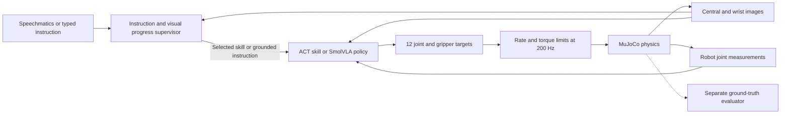

# Evidence-based training plan for Talos

## Decision

Train a camera-based **ACT imitation policy first**, compare it with **task-adapted SmolVLA**, and improve the winner with demonstrations collected from its failure states. Use a small supervisor to interpret instructions, select skills and check progress. Train coordinated movements as joint, twelve-action skills when both arms must cooperate.

This is an engineering recommendation informed by research, not a claim that ACT is the newest or universally best algorithm. Research was checked on **September 11, 2026**, including June–August papers and the September 10 release of `mjbatch`. No September manipulation-policy paper was verified that changes the recommendation. This is a focused assessment, not an exhaustive ranking of robotics research.

The immediate deliverable should be a reproducible dataset-to-policy-to-evaluation pipeline. Further scene decoration or a large foundation-model training run would not address the largest remaining uncertainty: whether a model can control our particular arms from images.

## What has actually been demonstrated

The current MuJoCo controller uses exact object positions, inverse kinematics, manually chosen grasps, trajectories and a task state machine. Geometry and motions were adjusted after physical failures. This is model-based robotics plus empirical engineering; no neural motor policy has been trained.

The saved [verification report](dinner-verification.json) records 11 successful full sequences across seeds 0–9 and 42. These use the same fixtures, targets and task order with small placement and dynamics changes. The other arm parks during each individual skill. These results establish a useful physical teacher, but do not establish visual generalization, meaningful two-arm cooperation or learned-policy success.

The scene includes deliberately graspable plate rims and thick utensil handles. Models trained only on those shapes cannot be claimed to handle ordinary household tableware. Glass and side plate manipulation, liquid transfer, qualifying Intel execution and Speechmatics integration remain outside the completed milestone. See [physical scope](DINNER_SCENE.md) and [challenge alignment](../hackathon/UPDATE_2026-09-11.md).

## Research foundation

“Proven” here means supported by experiments under a paper's stated conditions. It does not mean guaranteed to work on dual SO-101 arms. New preprints and vendor demonstrations have less independent validation than established methods. Percentages from different benchmarks are not directly comparable.

### Established methods worth using

| Approach | Evidence | Consequence for Talos |
|---|---|---|
| Action-chunk imitation | ACT originated in low-cost bimanual manipulation. Zhao et al. reported six real tasks with roughly 80–90% success from about ten minutes of demonstrations. This is a 2023 result, on different hardware. [^1] | A defensible first motor-learning baseline, especially with limited compute. It predicts several future joint targets together. |
| Compact pretrained VLA | SmolVLA, June 2025, combines images, instruction and robot state with a flow-matching action expert. Its authors evaluated simulation and real SO100/SO101 tasks. It still needs embodiment/task adaptation. [^2] | A feasible language-conditioned challenger; a single-arm checkpoint is not a ready dual-arm dinner policy. |
| Diffusion policy | The original work tested action diffusion on multiple manipulation benchmarks and real tasks, including multimodal actions and receding-horizon execution. [^3] | A useful alternative if motion ambiguity is the diagnosed problem; it adds iterative inference work. |
| Synthetic demonstrations | RoboTwin 2.0 covers 50 dual-arm tasks with structured randomization. DexMimicGen generated more than 20,000 demonstrations from 60 source demonstrations across its experimental tasks. [^4][^5] | Our physical teacher can produce learning data. Variation and physical acceptance checks matter more than repeating one animation. |
| Corrective imitation | DAgger addresses the distribution shift caused when a learner encounters states absent from expert demonstrations. Its theoretical guarantee depends on assumptions about the learner and expert. [^6] | Gather expert corrections from states visited by our policy. Our bounded, fallible teacher does not inherit a universal guarantee. |

Current LeRobot documentation recommends ACT as its starting model, describes approximately 80 million parameters, and supplies a Colab path. Its SmolVLA guide suggests around 50 episodes as a starting experiment and explicitly stresses repeated examples of each variation. Neither number is a sample-complexity guarantee for our task. [^7][^8]

### Recent advances and what they change

**VLAct — August 27, 2026.** This preprint emphasizes preserving visual-language representations during continued robot pretraining. It reports 82.6% on LIBERO-Plus and 92.5% on RoboTwin 2.0 in its protocols, using a 16-GPU pretraining setup. The evidence supports careful adaptation of pretrained representations; it does not justify recreating foundation pretraining on a 12 GB card. Keep it as a research comparator, not a deadline dependency. [^9]

**FlashVLA — August 27, 2026.** Li, Tang and Liu introduce streaming action decoding and evaluate asynchronous execution. Their training uses eight H200 GPUs; latency measurements include RTX 4090/5090. The practical lesson is to measure observation age and action continuity, rather than quoting an amortized action frequency as reaction speed. Implementing their method would require adaptation and training, not merely turning on a faster renderer. This is distinct from a different 2025 paper also using the name FlashVLA. [^10]

**Unified Visuomotor Targets (UVT) — August 4, 2026.** Feng and Jain supervise a compact latent combining robot actions and visual transitions. Their real plate-handover experiment improves from 18% to 40% success; the improvement is relevant, but the remaining failures are substantial. The method adds latent-target preparation and decoder integration, and is not validated here for ACT or SmolVLA. This is a promising later experiment once ordinary action learning works. [^11]

**Gemini Robotics 2 — July 30, 2026.** Google reports adaptation to bi-arm embodiments including SO101, typically with fewer than 200 examples. Its separation of reasoning/progress understanding from motor execution is relevant to our architecture. However, the VLA and On-Device models are early-access offerings; public reasoning-model access does not supply an unrestricted local motor checkpoint. These are developer-reported capabilities, not our reproduction. [^12]

**MinInter — June 23, 2026; author page reports CASE 2026 acceptance.** The paper finds that unnecessary interpolated transitions can damage synthetic imitation data and tests source-trajectory selection on 12 tasks with 26 variants. This supports physically validating trajectory transformations instead of assuming every modified successful motion is a good demonstration. Our teacher generator is not an implementation of MinInter. [^13]

**MolmoAct2 — May 2026.** An important open VLA/action-reasoning alternative with LeRobot integration. The documented port measures 12.1 GiB for a specific bf16 inference setup and 16.5 GiB for action-expert training at batch eight. That recipe exceeds our home GPU's practical budget. Smaller batches or compression might change feasibility, but have not been validated for our setup or Intel deployment. [^14]

**RL Tokens — March 19, 2026.** Physical Intelligence reports improving precise stages with a small RL policy using features from a VLA, rather than retraining the entire model online. Its four-task study motivates targeted refinement after a competent initial policy. It is not evidence that random exploration will solve our complete dinner routine quickly. [^15]

The newest ideas are therefore relevant to **representation quality, synthetic-data quality, correction, and responsive execution**. They do not eliminate the need for good demonstrations or task-specific tests. There is no verified downloadable policy in this review that already completes our exact dual-SO101 MuJoCo scene.

## Architecture and information boundaries

The policy learns the movement. The low-level servo remains responsible for executing bounded position targets. A language model should not generate unconstrained motor commands every physics tick.

For the first ACT experiment, use a fixed bottle-to-serving-area task. Stock ACT does not interpret language. Extend with separately selected skill checkpoints before considering a custom task-conditioned ACT architecture. A visible target marker can specify the initial fixed goal; arbitrary destination selection requires an explicit observation/conditioning contract and matching data.

SmolVLA receives a short grounded instruction as well as images and robot state. Balanced examples must require different actions under the same visual scene: for example, place the mug versus the plate. Paraphrases alone do not prove that language controls the actions.

Ground-truth object poses, contacts, task phase and outcome labels may be used for **teacher generation, training labels and independent evaluation**. They must not silently enter the camera policy or advance its production skill sequence. Start with a separately labeled oracle supervisor for diagnosis if necessary; replace it with image-based progress checks before claiming a fully observation-driven system. Keep teacher-assisted and policy-only results separate.

A practical progress model can classify skill completion/failure from short image sequences and joint measurements, using simulator labels during training. Require stable visual evidence before advancing, and evaluate false completion predictions on failed rollouts. A fixed elapsed-time transition is not adequate proof that a grasp succeeded.

## Exact implementation and training sequence

All counts, rates, thresholds and experiment budgets below are proposed project settings. They are not organizer requirements or values proven optimal by the cited papers.

### 1. Freeze the interface and evaluator

Create a Gymnasium-style adapter around the existing environment without replacing the browser or physics engine. Pin the model version, scene hash, camera calibration, joint order, preprocessing, normalization and evaluation seed manifest. Keep a separate training environment so installing LeRobot does not alter the working MuJoCo environment.

| Field | Initial contract |
|---|---|
| Observations | RGB images plus measured robot joint positions; no object-state fields |
| Camera capture | Central, left wrist and right wrist at matching timestamps; pilot uses central plus active wrist |
| Image size | Retain 640×480 source frames; initially test ACT at 320×240, checking that thin handles and jaw gaps remain visible |
| State/action order | Left five joints + left gripper, then right five joints + right gripper |
| Actions | Twelve absolute nominal joint-position targets in radians |
| Physics/servo | Existing 200 Hz fixed timestep |
| Dataset/action grid | Initial 20 Hz, with explicitly defined hold/interpolation semantics |
| Policy access | Images, joint state and selected skill/instruction only |
| Evaluator access | Full physics state for contacts, displacement, uprightness, final placement and coordination |

The current recorder saves 200 Hz nominal/applied commands and 20 Hz observations, but exports images at only 5 Hz. Regenerate synchronized images at the selected learning frequency from saved states. Do not repeat a 5 Hz frame and pretend it is a fresh 20 Hz observation. Preserve pre-action timestamp alignment.

Record **nominal targets**, not the torque-limited `ctrl`, as the policy's labels. Reapply the same torque-limiting function using current joint position and velocity during deployment. The per-skill torque cap must be declared in the skill contract, not secretly selected from the teacher's hidden phase. A two-arm skill needs limits for both grippers.

Before training, replay the resampled commands through physics from reset, with the exact proposed execution adapter. Restoring saved positions for image reconstruction is acceptable; it is not a physical action-replay test. Require the replay to retain physical task success. If 20 Hz sampling fails, revise the execution contract or increase the rate before collecting the dataset.

**Exit condition:** ten pilot trajectories pass timestamp/schema checks and physical action replay; the policy adapter demonstrably excludes privileged object fields.

### 2. Generate diverse, physically valid demonstrations

Start with **100 successful bottle-placement training episodes and 20 separate validation episodes**. First collect ten to measure rendering/storage throughput. Spread starts across at least ten reachable position/orientation regions, with several examples per region. Expand beyond the existing millimetre jitter only after reachability and collision checks; do not prescribe impossible positions for a five-joint arm.

Keep all attempts and rejection reasons in a generation log. Accept success into behavior-cloning data only after contact, retention, release and stable-placement checks. Teacher failure in a region is a coverage gap, not permission to quietly exclude that region from evaluation.

Use a curriculum: placement variation first, then friction/mass, then illumination/background, then additional graspable shape variants. Preserve object identity across colors so a model cannot solve the task solely through one color cue. Revalidate stability and reach after geometry changes. Do not randomize everything at once and lose the ability to diagnose failure.

Preserve parent episode/layout identity through augmentation. All render variants, crops and transformed copies of one trajectory belong to the same split. Normalize using training data only. Store failed episodes separately for evaluator training and later corrective collection.

**Exit condition:** a dataset manifest documents coverage, physical acceptance rate, lineage, synchronized cameras and independent validation episodes.

### 3. Train ACT and prove that it uses vision

Use the inspected LeRobot v0.6.1 ACT implementation as the initial reference pin, subject to an installation smoke test. Start with its ResNet-18 backbone, variational action-chunk objective and optimizer defaults. The inspected configuration uses learning rate 1e-5, weight decay 1e-4 and KL weight 10. [^16]

Proposed overrides: batch eight if memory permits, chunk length 20 at the 20 Hz grid, and execute four targets before replanning. This means a one-second prediction horizon and a nominal 200 ms observation-to-replan interval. Begin without temporal ensembling. The inspected implementation requires one action step per invocation when ensembling is enabled; do not combine incompatible settings. [^16]

First overfit five training episodes as a pipeline diagnostic. Then run the diverse dataset: inspect checkpoints at 2,000, 5,000 and 10,000 updates; extend toward 20,000 only if validation rollouts are still improving. Record examples seen and GPU time as well as update count. These are experiment budgets, not convergence promises.

Select checkpoints using validation **closed-loop success**, not action-prediction loss alone. Run a second initialization for the selected recipe when feasible. If it can imitate five episodes but fails new positions, improve coverage and corrective data before escalating model size.

**Exit condition:** at least 18/20 validation rollouts succeed, and paired changed-position tests show that actions respond appropriately to the images. A state-only baseline and frozen/blank-image diagnostic establish whether the network merely memorizes the teacher's path. The threshold is a development gate with substantial sampling uncertainty.

### 4. Add remaining skills and real cooperation

After the bottle pipeline works, collect plate, mug, drawer, fork and spoon episodes with the same contract. Start at 50 successful training episodes per additional skill and increase the weak skills toward 100–200 based on measured failures. Balance sampling by skill so a long drawer trajectory does not dominate every training batch.

Develop one physically verified **handoff**, initially a reachable bottle transfer with complementary grasp locations, before collecting coordinated data. Recheck whether both five-joint arms can approach without collision; if the object cannot provide two simultaneous secure grasps, choose a plate handoff after a geometry/reach test. Do not force a gesture that looks cooperative but has no meaningful dependency.

The receiving hand must establish support before the donor releases, then retain the object after the donor withdraws. The evaluator checks that complete sequence. Train a single twelve-action policy for this skill using both wrists and the central view. Two separately trained single-arm policies are not assumed to coordinate.

For learning the complete routine, collect continuous chains as well as reset-based skills. Later skills must see the small position errors left by earlier ones. Test chaining without resetting props to perfect intermediate states. This is essential: even six independent 90%-reliable steps would yield only about 53% full-chain success; independence is only an illustration, not an assumed model of our actual failures.

**Exit condition:** the teacher demonstrates a genuine handoff; the learned skills complete at least 16/20 validation chains without teacher correction. Until then, report component success separately.

### 5. Compare SmolVLA and add corrective data

Fine-tune the released SmolVLA base on the same demonstrations, with explicit twelve-dimensional state/action mapping and declared camera ordering. Start with a memory smoke test at batch one or two and frozen vision components where supported; use gradient accumulation if needed. Do not assume an arbitrary upstream pretrained action normalization matches our radians or gripper convention.

Give ACT and SmolVLA the same data splits and evaluation tasks. Report both success versus demonstrations and success versus GPU hours. A four-hour initial challenger budget is a scheduling cap, not a predicted training duration. Promote SmolVLA only if instruction responsiveness, task performance and Intel latency justify its added complexity.

For either policy, run 20–50 development rollouts and categorize misses, slip, early release, drawer misalignment and sequencing errors. Collect roughly 20–50 corrective segments in a first round. The teacher must replan from the actual encountered state; replaying the original nominal trajectory is not a corrective expert. If the current teacher cannot recover, record that limitation and build a verified recovery rather than supplying invalid labels.

Aggregate valid corrections with the original data and retrain. Repeat at most two collection rounds before the submission freeze. This is DAgger-inspired corrective imitation, not a claim to reproduce the original algorithm's guarantees. Never use final evaluation seeds for correction. [^6]

### 6. Validate Intel deployment early and select the final system

Run export with the intended input dimensions before expensive model training. Intel Physical AI Studio documents ACT export to OpenVINO; this is an implementation lead, not proof that a LeRobot checkpoint is interchangeable with its Lightning checkpoint. Validate weight conversion and numerical agreement. [^17]

Measure CPU/GPU options on actual Core Ultra Series 2/3 hardware. NPU execution is conditional on operator support and measured benefit. Report preprocessing, inference, scheduling and rendering separately, and also report complete wall-clock task time. The final hardware requirement is independent of where training occurs.

Start with ordinary synchronous policy inference in a deterministic offline evaluator. Then test continuous real-time execution without pausing physics while the policy thinks. At the proposed 200 ms replanning interval, p95 latency plus acquisition/scheduling must leave practical margin; otherwise adjust timing and reevaluate task success. Abort or hold safely on stale commands instead of applying a late action chunk blindly.

SmolVLA has a documented real-time chunking route for aligning asynchronous chunks. Its guide does not prove that this entire inference procedure exports unchanged to OpenVINO. Treat timing integration as its own test. [^18]

## Evaluation protocol

Freeze the distributions and seed lists before comparing finalists. Existing seeds 0–9 and 42 are development seeds, not unseen evidence.

| Suite | Proposed count | What it establishes |
|---|---:|---|
| Development validation | 20 rollouts per checkpoint/skill | Model and checkpoint selection |
| Final nominal evaluation | 50 new episodes | Success within the declared training distribution |
| Shifted conditions | 50 new episodes | Separate placement, shape, dynamics and visual shifts; report each category |
| Recovery | 20 controlled perturbation episodes | Recoverable disturbance handling and bounded aborts |
| Language | 20 paired instruction tests | Same scene, different valid goals; evaluate correct object and destination |
| Submission demonstration | Ten predeclared seeds from the final suite | Reproducible video evidence, with failures disclosed |

For finalists, report full-task success, each skill's success, grasp loss, collisions, false completion, timeout, teacher interventions, end-to-end latency and runtime. Report successes/attempts and Wilson confidence intervals. Fifty trials are still a limited estimate; ten successful video runs do not establish universal reliability.

Keep controlled ablations small: ACT versus SmolVLA; original versus corrective data; narrow versus expanded variation; synchronous versus continuous inference; and the two-arm skill with/without the coordinated training set. Change one factor at a time. Use validation for ablations and evaluate the frozen winner on final seeds once. If final failures lead to changes, declare the old suite development data and create a new final set.

A nonzero success rate with blank images can be reasonable in a fixed scene. The important test is whether the policy can react correctly when only the visible object position or requested goal changes. Also check that the supervisor does not obtain that information from hidden simulator state.

## Hardware and schedule

The RTX 4070 with 12 GB VRAM is a good initial ACT training target. SmolVLA adaptation is plausible with restricted batches/components, but must pass an actual memory test. LeRobot's rough envelopes are 2–6 GB for light BC, 8–14 GB for diffusion, and 10–16 GB for small VLA at its stated batch-eight settings. These are estimates, not measurements on Talos. [^19]

Colab is available now, but its assigned accelerator is unknown. Inspect it before selecting precision and batch size. Use resumable checkpoints containing optimizer, scheduler, normalization and configuration, so work can continue on the home GPU from Sunday, September 13. Colab availability and runtime limits vary. [^20]

Budget data generation too. One hundred full 250-second routines represent about 6.9 hours of simulated time and 1.5 million individual camera frames at three views × 20 Hz. Wall time depends on physics, IK, rendering and encoding throughput. This calculation is why short-skill pilots come first. Measure ten episodes before committing to large counts.

| Date | Planned outcome | Decision if blocked |
|---|---|---|
| September 11 | Dataset/action contract, replay checks, ten-episode throughput test, export smoke test | Fix interface before mass generation |
| September 12 | First visual ACT bottle result; verified coordinated teacher candidate | Diagnose data/physics failure before increasing model size |
| September 13 | Continue on RTX 4070; expand skills and perform bounded SmolVLA comparison | Retain ACT if the challenger lacks a feasible deployment path |
| September 14 | Corrective collection, coordinated learned skill, instruction/progress integration | Keep claims limited to demonstrated behavior |
| September 15 | Frozen evaluation, qualifying Intel measurements, Speechmatics demonstration | Fix essential integration only; no new policy family |
| September 16 | Reproduction, ten-seed evidence and submission before internal 18:00 CEST target | Published deadline recorded in challenge notes: 20:30 CEST |

This is an aggressive work plan, not a promise that all learned skills will meet the gates. Qualifying Intel access remains unresolved and should be pursued immediately. A working 4070 demonstration does not replace it.

## Where mjbatch fits

`mjbatch` is recent CPU simulation infrastructure, not an ACT/VLA trainer. It could accelerate independent rollouts, parameter sweeps and eventually RL. It does not itself provide our visual demonstrations, rewards, task controller, camera batching or language policy. Its toy locomotion timing is not a prediction for contact-rich dinner manipulation.

At the inspected commit it explicitly excludes Windows wheels and pins MuJoCo 3.11.0. Our working environment uses native Windows and 3.12.0. Keep it out of that environment. See the [pinned source and risk assessment](MJBATCH_REVIEW.md) for the static review and proposed isolated benchmark.

## Novelty worth attempting

The strongest short-deadline contribution is a measured combination: physically checked synthetic demonstrations, camera-based bimanual control, correction from learner failures, and responsive Intel execution. This is system integration and evaluation novelty, not a claim to invent imitation learning.

A small optional experiment is a visual failure/progress predictor that triggers bounded re-observation or selects a learned recovery. Compare it with a fixed retry rule and measure both avoided failures and false alarms. Simulator labels can train it, but its deployed inputs must remain observable.

UVT-style supervision, targeted residual RL, 3D-equivariant policies and world-action models are research extensions after the baseline. Each adds data, implementation or deployment requirements. RL becomes justified if imitation consistently fails one recoverable stage and rollouts are fast enough to improve it; it should begin from a competent policy with explicit outcome rewards, not an unrestricted random-action dinner task.

No paywalled paper is currently blocking this plan. The cited central papers and implementation references are publicly accessible. The important missing evidence is now our own controlled training and Intel evaluation.

## Sources

All web references checked September 11, 2026. Results remain author-reported unless explicitly identified as local project measurements.

[^1]: Zhao et al. [Learning Fine-Grained Bimanual Manipulation with Low-Cost Hardware](https://arxiv.org/abs/2304.13705), April 2023.
[^2]: Shukor et al. [SmolVLA: A Vision-Language-Action Model for Affordable and Efficient Robotics](https://arxiv.org/abs/2506.01844), June 2, 2025.
[^3]: Chi et al. [Diffusion Policy](https://diffusion-policy.cs.columbia.edu/), RSS 2023; IJRR 2024.
[^4]: Chen et al. [RoboTwin 2.0](https://arxiv.org/abs/2506.18088), June 2025; revised August 2025.
[^5]: Jiang et al. [DexMimicGen](https://dexmimicgen.github.io/), ICRA 2025.
[^6]: Ross, Gordon and Bagnell. [A Reduction of Imitation Learning and Structured Prediction to No-Regret Online Learning](https://proceedings.mlr.press/v15/ross11a.html), AISTATS 2011.
[^7]: Hugging Face. [LeRobot ACT documentation](https://huggingface.co/docs/lerobot/act), current guide.
[^8]: Hugging Face. [LeRobot SmolVLA documentation](https://huggingface.co/docs/lerobot/smolvla), current data and adaptation guidance.
[^9]: Yang et al. [Beyond Data Scaling: Representation-Centric Continued Pre-training for Vision-Language-Action Models](https://arxiv.org/html/2608.27550v1), August 27, 2026, preprint.
[^10]: Li, Tang and Liu. [FlashVLA: Streaming Action Decoding for Fast and Asynchronous VLA Inference](https://arxiv.org/html/2608.27384v1), August 27, 2026, preprint.
[^11]: Feng and Jain. [Unified Visuomotor Targets: Supervising VLAs Beyond Physical Actions](https://arxiv.org/html/2608.03563v1), August 4, 2026.
[^12]: Google DeepMind. [Gemini Robotics 2 brings whole body intelligence to robots](https://deepmind.google/blog/gemini-robotics-2-brings-whole-body-intelligence-to-robots/), July 30, 2026.
[^13]: Wang et al. [MinInter](https://arxiv.org/html/2606.24078v1), June 23, 2026; [acceptance metadata](https://arxiv.org/abs/2606.24078).
[^14]: Hugging Face. [MolmoAct2 policy documentation and memory protocol](https://huggingface.co/docs/lerobot/molmoact2), current guide; model released May 2026.
[^15]: Xu et al., Physical Intelligence. [Precise Manipulation with Efficient Online RL](https://www.pi.website/research/rlt), March 19, 2026.
[^16]: Hugging Face. [ACT configuration, LeRobot v0.6.1](https://github.com/huggingface/lerobot/blob/v0.6.1/src/lerobot/policies/act/configuration_act.py), inspected source.
[^17]: Intel/open-edge-platform. [Physical AI Studio library: export and checkpoint interfaces](https://github.com/open-edge-platform/physical-ai-studio/blob/main/library/README.md), current source.
[^18]: Hugging Face. [Real-Time Chunking](https://huggingface.co/docs/lerobot/rtc), current implementation guide.
[^19]: Hugging Face. [Compute Hardware Guide](https://huggingface.co/docs/lerobot/hardware_guide), indicative memory and throughput, not a Talos benchmark.
[^20]: Google. [Colab FAQ](https://research.google.com/colaboratory/faq.html), runtime and accelerator availability.

Local evidence: [dinner verification](dinner-verification.json), [scene and physical results](DINNER_SCENE.md), [recorder source](../../simulation_lab/recording.py), [fresh challenge alignment](../hackathon/UPDATE_2026-09-11.md). This report supersedes the next-training priorities in the earlier chemistry-oriented AI control note; no training run or new simulator installation was performed for this assessment.
